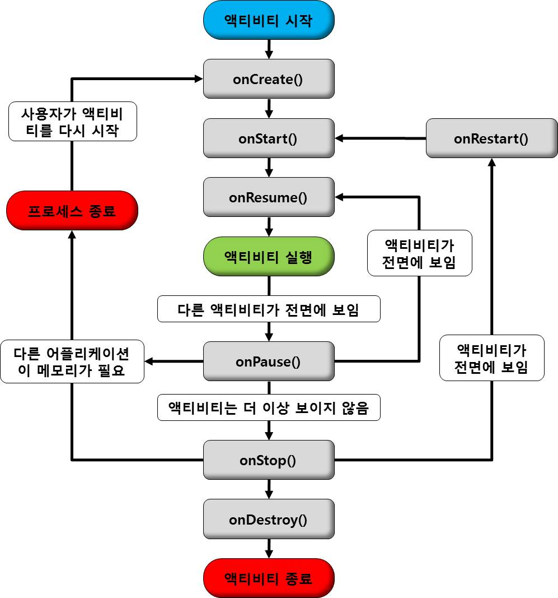

# Acitivty LifeCycle
- 화면이 활성화 되고 죽기까지의 생명주기가 있다.
- 다른 액티비티에 의해 잠시 가려지거나 앱이 종료될 때와 같은 모든 상태 변화가 있을 때 액티비티의 생명 주기 메소드가 호출된다.
- 앱이 한정적인 리소스를 사용하는 만큼, 리소스 관리를 하기 위해서는 상황에 맞게 적절한 생명주기 콜백 메소드를 구현해야 한다.



| 메소드        | 설명 |
| --------      | ----------- | 
| `onCreate()`  | 액티비티가 생성될 때 호출.|
| `onRestart()` | 액티비티가 멈췄다가 다시 시작되기 바로 전에 호출. |
| `onStart()`   | 액티비티가 사용자에게 보여지기 바로 직전에 호출. |
| `onResume()`  | 액티비티가 사용자와 상호작용하기 바로 전에 호출. |
| `onPause()`   | 다른 액티비티가 보여질 때 호출. |
| `onStop()`    | 액티비티가 더이상 사용자에게 보여지지않을 때 호출됨 |
| `onDestroy()` | 액티비티가 소멸될 때 호출. |

## 액티비티 생성
액티비티가 사용자 화면에 보이고 있고 포커스를 가지고 있다. 

onCreate -> onStart() -> onResume()

## 다른 액티비티 실행
다른 액티비티로 인해 화면이 완전히 가려진 상태.

onPause() -> onStop()

## 다시 돌아왔을 때
화면을 가렸던 액티비티가 사라지면서 다시 활성 상태.
onRestart() -> onStart() -> onResume()

## 액티비티 종료
onPause() -> onStop() -> onDestroy()

## 1. onCreate()
---
- 액티비티 실행 시 딱 한번만 동작되고 레이아웃 구성, 초기화, ViewModel연결 등 로직을 구현하는 메소드로 꼭 오버라이딩하여 구현해야 한다.
- setContentView()는 onCreate()에 종속적인 메소드로, 반드시 onCreate() 안에서 구현해야한다.
- savedInstanceState 매개변수를 가지고 있는데 이는 액티비티의 이전 상태가 저장된 Bundle 객체이다. 처음 생성된 액티비티인 경우 값은 null이 저장되어있다.
```
lateinit var textView: TextView

var gameState: String? = null

override fun onCreate(savedInstanceState: Bundle?) {
    super.onCreate(savedInstanceState)

    gameState = savedInstanceState?.getString(GAME_STATE_KEY)

    // 레이아웃 xml 정의
    setContentView(R.layout.main_activity)

    textView = findViewById(R.id.text_view)
}

// 저장된 인스턴스가 있는 경우에만 호출.
override fun onRestoreInstanceState(savedInstanceState: Bundle?) {
    textView.text = savedInstanceState?.getString(TEXT_VIEW_KEY)
}
```

## 2. onStart()
- onCreate()를 호출한 뒤 액티비티가 시작됨 상태가 되면 호출한다. 매우 빠른 속도로 실행된다.
- 액티비티를 포그라운드에 보내 사용자와 상호작용 할 수 있도록 준비한다.

## 3. onResume()
- 액티비티가 포그라운드에 표시되고 사용자와 상호작용한다.
- 앱에서 포커스가 떠날 때까지 이 상태에 머무른다.
- 액티비티가 재개될 때마다 필요한 다른 초기화 작업을 수행한다.

## 4. onPause()
- 사용자가 잠시 액티비티를 떠났을때 호출되는 콜백 메소드이다. 즉, 해당 액티비티가 포그라운드에 있지 않게 되었다는 것을 의미한다.
- 액티비티가 포그라운드에 없을 동안 계속 실행되어서는 안되지만 언젠가 다시 시작할 작업을 일시중지하는 작업을 수행한다.
- 액티비티의 스타일 속성이 투명하다고 선언된 다른 액티비티가 실행되면 onPause()까지만 호출된다.

## 5. onStop()
- 액티비티가 사용자에게 더 이상 표시되지 않는다.
- 필요하지 않은 리소스를 해제하거나 조정해야 한다. 애니메이션을 일시중지하거나 GPS 사용 시 배터리를 아끼기 위해 위치 정확도를 대략적인 위치로 전환 할 수 있다. CPU를 비교적 많이 소모하는 작업을 종료해야 한다.

## 6. onDestroy()
- 액티비티가 완전히 소멸되기 전에 호출된다.
- 해제되지 않은 리소스가 있다면 모두 여기서 해제해줘야 메모리 누수를 줄일 수 있다.  

# Fragment LifeCycle
- Fragment도 Activity와 같이 고유한 생명주기가 있다.
- 생명주기를 준수하지 않으면 메모리 누수 또는 비정상 종료가 발생 할 수 있다.  


## 1. onAttach()
- Fragmnet가 액티비티에 포함되는 순간 호출된다.

## 2. onCreate()
- 액티비티의 onCreate()와 동일하다.
- 아직 Fragment View가 생성되지 않았기 때문에 View에 관련된 작업을 두기에는 적절하지 않다.

## 3. onCreateView()
- Fragment의 UI 구성을 위해 호출된다.
- onCreateView()를 재정의하여 fragment의 view를 inflate 또는 생성 할 수 있다.

## 4. onViewCreated()
- onCreateView()를 통해 반환된 View객체는 onViewCreated() 파라미터로 전달된다.
- View의 초기 상태를 설정하기 적절한 위치.

## 5. onStart()
- 액티비티의 onStart()와 동일하다.
- Fragment가 사용자에게 보여질 수 있을때 호출된다.
- Fragment의 자식 FragmentManager가 FragmentTransaction을 수행하는 것이 안전함을 보장한다.

## 6. onResume()
- 액티비티의 onResume()와 동일하다.
- Fragment가가 사용자와 상호작용할 수 있을 때 호출된다.
- onResume() 이 호출되지 않은 시점에서는 입력을 시도하거나 포커스를 설정하는 등의 작업을 임의로 하면 안된다.

## 7. onPause()
- 액티비티의 onPause()와 동일하다.
- 사용자가 Fragment 를 떠나기 시작했지만 Fragment 는 여전히 visible 일 때 호출된다.

## 8. onStop()
- 액티비티의 onStop()와 동일하다.
- Fragment 가 더이상 화면에 보여지지 않게 되면 호출된다.

## 9. onDestroyView()
- Fragment가 화면에서 사라진 후 BackStack에 추가된 후 호출된다.
- 가비지 컬렉터에 의해 수거될 수 있도록 Fragment View 에 대한 모든 참조가 제거되어야한다.

## 10. onDestroy()
- 액티비티의 onDestroy()와 동일하다.
- view가 제거된 후 Fragment가 완전히 소멸되기 전에 호출된다.

## 11. onDetach()
- Fragment가 액티비티에서 제거될 때 호출된다.

# Context
- 새로 생성된 객체가 지금 어떤 일이 일어나고 있는지 알 수 있도록 한다.
- 안드로이드의 액티비티는 context 객체를 상속받는다. 액티비티는 애플리케이션의 특정 리소스와 클래스, 환경에 대한 정보에 대해 접근할 수 있게 한다.
- context를 잘못 사용하는 것은 애플리케이션의 메모리 누수를 일으킬 수 있다.

## Context의 종류
### 1. Application Context
- 싱글턴 인스턴스이며 액티비티에서 getApplicationContext()를 통해 접근할 수 있다.
- 애플리케이션 라이프사이클과 연결되어있다.
-  현재의 컨텍스트와 분리된 라이프사이클을 가진 컨텍스트가 필요할 때나 액티비티의 범위를 넘어서 컨텍스트를 전달할 떄에 사용한다. 예를 들어, 싱글턴 객체에서 컨텍스트가 필요하면 application context를 사용하면 된다. 하지만 여기에서 activity context를 사용하면 메모리 누수가 발생 할 것이다. 그 이유는 activity는 가비지 콜렉터에 의해 수집되지 않는데 activity context는 activity의 참조를 계속 유지하기 때문이다.
- Application context로는 대부분의 GUI 작업을 할 수 없다.
- Toast는 Application Context를 이용해도 아무 문제가 없이 잘 뜬다. Toast는 특정 액티비티에 연관된 윈도우에 속하지 않고, 자신만의 윈도우를 생성하기 때문이다.

### 2. Activity Context
- activity에서 사용 가능하며, 액티비티의 라이프사이클과 연결되어 있다.  
즉, 액티비티가 onDestroy()가 호출되면 사라지는 객체이다.

> https://developer.android.com/guide/components/activities/activity-lifecycle?hl=ko
> https://velog.io/@haero_kim/Activity-Lifecycle-%EC%99%84%EB%B2%BD-%EC%A0%95%EB%B3%B5%ED%95%98%EA%B8%B0  
> https://readystory.tistory.com/199  
> https://developer.android.com/guide/fragments/lifecycle
> https://shinjekim.github.io/android/2019/11/01/Android-context%EB%9E%80/
