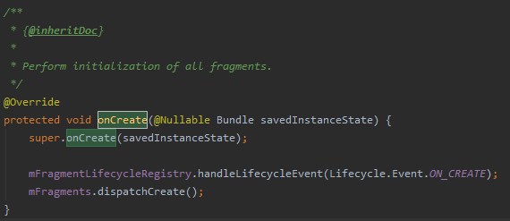
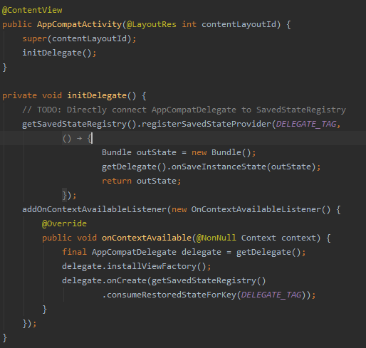

# 생명주기 콜백 함수
 - onCreate()
 - onStart()
 - onResume()
 - onPause()
 - onStop()
 - onDestroy()

## onCreate()

이름 그대로 액티비티가 생성될때 현재 생성 상태임을 알려주는 콜백이다.

보통 이 단계에서 변수들을 초기화 하는것을 권장하며, 안드로이드 context를 필요로 하는 객체인 경우 필수로 지켜야할 사항이다.

이는 밑의 코드를 보면 이해가 갈것이다.

```
// 크래쉬 발생
class MainActivity : AppCompatActivity() {
    private var button = Button(this)

    override fun onCreate(savedInstanceState: Bundle?) {
        super.onCreate(savedInstanceState)
        setContentView(R.layout.activity_main)
        
        button.text = "button"
    }
}
```

```
// 정상 작동
class MainActivity : AppCompatActivity() {
    private lateinit var button: Button

    override fun onCreate(savedInstanceState: Bundle?) {
        super.onCreate(savedInstanceState)
        setContentView(R.layout.activity_main)

        button = Button(this).apply { 
            text = "button"
        }
    }
}
```

```
// 코틀린에서는 더 간단하게 해결할 수 있다.
class MainActivity : AppCompatActivity() {
    private val button by lazy { Button(this) }

    override fun onCreate(savedInstanceState: Bundle?) {
        super.onCreate(savedInstanceState)
        setContentView(R.layout.activity_main)

        button.text = "button"
    }
}
```

오케이 여기까진 이해됐다.
근데 왜 MainActivity 생성자에서 context 참조가 안되는걸까?

답은 위 코드에서 super.onCreate 코드를 타고 들어가보면 AppCompatActivity가 아닌,
왠 이상한 FragmentActivity 클래스가 나온다. 이는 AppCompatActivity에는 onCreate() 구현체가 없으며,
AppCompatActivity 클래스에서 FragmentActivity를 상속받아 onCreate()를 구현하였기 때문이다.



위 코드가 FragmentActivity 클래스의 onCreate 구현체다.
해당 클래스에서도 super.onCreate() 호출하고 있으며,
여기서는 프래그먼트의 생명주기와 FragmentController를 관리한다.

좀더 깊게 들어가보자...
이번엔 ComponentActivity 클래스의 onCreate()가 보인다.


`mContextAwareHelper.dispatchOnContextAvailable()` 함수를 호출하여 액티비티의 Context가 유효한 상태인지를 통지한다.

최종적으로 AppCompatActivity의 initDelegate() 함수안에 있는 OnContextAvailableListener의 onContextAvailable()에서 context 접근 가능을 통지받은 후에 생명주기 상태를 초기화하고 onCreate()를 호출한다.



결국 위에서 생각했던 의문점이 해결됐다.

짧게 설명 해보자면,
androidx.activity.ComponentActivity.onCreate() 단계에서 context 접근을 허용 한 뒤
ComponentActivity -> FragmentActivity -> AppCompatActivity -> MainActivity의 onCreate()가 호출이 된다.

때문에 context 접근불가한 상태(MainActivity 생성자)에서는 context 참조가 불가능하다.

# onStart()

이 단계는 View를 그리기 직전의 단계이다.
다행이 onCreate() 보다는 단순한 구조다.

Activity -> FragmentActivity -> AppCompatActivity -> MainActivity 순으로 onStart가 호출되며,

FragmentActivity는 자신이 갖고있는 Fragment의 생명주기를 onStart 상태로 통지한다.

# onResume()

뷰가 그려지고 액티비티에 포커스가 잡혔을때 호출된다.

보통 사용자와 상호작용이 준비된 상태라고 이야기한다.

마찬가지로 여기서도 FragmentActivity는 Fragment의 생명주기를 onResume 상태로 통지한다. 

# onPause()

액티비티가 포커스를 잃었을때 호출된다.

이는 아직 화면은 보이며 액티비티 위에 팝업이나 다이얼로그가 떴을때도 호출된다.

마찬가지로 FragmentActivity는 Fragment의 상태를 onPause로 통지함.

# onStop()

액티비티가 화면에서 완전히 가려졌을 때 호출된다.

이 단계는 다른 액티비티가 열렸을때 onCreate()단계 이후 바로 호출되기도 하며,
홈키를 눌러서 백그라운드 상태로 갔을때도 호출된다.

마찬가지로 FragmentActivity는 Fragment의 상태를 onStop으로 통지.

# onDestroy()

액티비티가 소멸하기전 단계에서 호출된다.

사용자가 앱의 task를 날리면 호출이 안됨.
이를 호출시키려면 Service를 사용해야한다.

또한,  앱이 오랫동안 백그라운드에서 돌아가다가 메모리가 부족한 경우 호출된다.

마찬가지로 FragmentActivity는 Fragment의 상태를 onDestroy로 통지.