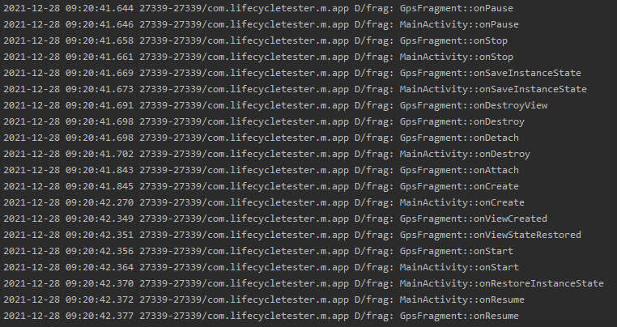

# 화면회전시 LifeCycle처리
===========================

# 화면 회전시 라이프사이클에 진행과정

    
    - 화면 회전시 Activity가 완전히 Destroy가 된 후 모든것을 처음부터 다시 그린다.
      onSaveInstanceState호출되는 시점에 해당 번들에 회전후 Activity, Fragment가 다시 생성될때 필요한 데이터를 저장하고,
      Fragment의 onViewStateRestored, Activity의 onRestoreInstanceState 호출되는 시점에 다시 해당 데이터를 불러와서 사용한다.
      
      그런데 꼭 onSaveInstanceState에 필요한 데이터를 저장해놔야 할까?
      ViewModel은 싱글톤객체이고, 해당 Activity가 있는 상태에서는 데이터 값이 유지된다.
      그러면 화면 회전시 필요한 데이터를 ViewModel에 저장해둬도 무방하지 않을까?
      그렇다. 그냥 ViewModel에 데이터를 저장해둬도 무방하다.
      
      ChatViewModel 클래스에
      val m_chatList = mutableListOf<String>()
      을 선언하여 채팅 입력한 내용을 저장해뒀다.
      
      그리고 화면 회전후 재 생성시 m_chatList데이터를 RecyclerViewd의 adapter에 다시 설정해줬다.
      
      그런데 예제코드에 찜찜한 부분이 있다. 채팅리스트를 2중으로 관리하게 되버린다.
      즉 ChatListAdapter의 m_chatData와 ChatViewModel에서의 m_chatList가 동시에 채팅데이터를 저장하게 되어 버린다. 올바른 방법은 아닌것 같다.
      ChatListAdapter에서 m_chatData를 일원화 해서 관리하는것이 효율적일듯 하다.
      
      그러면 결국 ChatListAdapter의 m_chatData를 onSaveInstanceState호출 시점에 저장해두고, onViewStateRestored시점에 다시 불러와서 설정해주는게 더 좋은 방법이지 않나 싶다.
      
    - 또한 앱이 백그라운드 상태에서, 시스템에서 앱을 강제로 종료 시켜버린 경우, 다시 앱 실행시 현재 화면으로 가고 싶다면??
      이경우 또한 onViewStateRestored, onRestoreInstanceState이 호출된다. 즉 해당화면으로 복원이 용이하다.
      
#  화면 회전시 view유지 방법
    AndroidManifest.xml에
     <activity 
       android:name=".MainActivity" 
       android:configChanges="keyboardHidden|orientation|screenSize"/>
     를 설정한다.
     orientation은 화면 회전시 Activity를 재시작 하지 않고, 구성 변경을 개발자가 직접 처리한다는 속성이다.
     
     해당 설정을 주면 Activity에서 onConfigurationChanged가 호출된다.
     이곳에서 새로 회면 회전에 맞는 뷰를 새로 inflate하고, binding도 다시 연결해줘야 한다.
     
     화면 회전에 따라서 layout inflate도 다시해야 하고, 필요한 View의 설정도 다시 해야 한다.
     결국 그냥 화면 회전에 따라서 onDestroy -> onCreate로 이어지는 라이프사이클을 이용하는게 더 직관적이고 효율적이지 않을까? 
     
     그렇다면은 이렇게 사용하는것이 효율적인 경우는 어떤 경우일까?
     잘 모르겠다.....ㅜㅜ;
     
     
          
    
      
      
      

