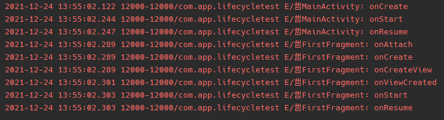
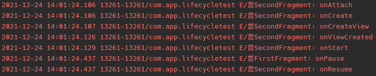
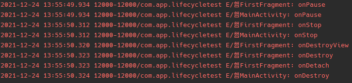

## activityViewModels()
- 하나의 Activity에 attach된 여러 Fragment들은 Activity에 종속되는 ViewModel을 생성함으로써 데이터를 공유 및 전달 할 수 있다.

- activityViewModels()
````
public inline fun <reified VM : ViewModel> Fragment.activityViewModels(
    noinline factoryProducer: (() -> Factory)? = null
): Lazy<VM> = createViewModelLazy(
    VM::class, { requireActivity().viewModelStore },
    factoryProducer ?: { requireActivity().defaultViewModelProviderFactory }
)
````

- viewModels()
````
public inline fun <reified VM : ViewModel> Fragment.viewModels(
    noinline ownerProducer: () -> ViewModelStoreOwner = { this },
    noinline factoryProducer: (() -> Factory)? = null
): Lazy<VM> = createViewModelLazy(VM::class, { ownerProducer().viewModelStore }, factoryProducer)
````

1. activity 실행. fragment Attach


2. second fragment Attach


3. activity 종료.


4. 화면 회전.


## 화면 회전을 해도 상태 보존 할 수 있는 이유.
- 화면 회전을 하면 activity/Fragment가 Destory된다. ViewModel를 사용하면 Destory가 되어도 데이터를 보존 할 수 있다.

```
class MainActivityViewModel : ViewModel() {
  private val _counterLiveData = MutableLiveData(0)
  val counterLiveData: LiveData<Int> = _counterLiveData

  fun incrementByOne() {
    _counterLiveData.value = _counterLiveData.value?.plus(1)
  }
}
```
```
val viewModel = MainActivityViewModel()
findViewById<Button>(R.id.btn_increment).setOnClickListener {
  viewModel.incrementByOne()
}
viewModel.counterLiveData.observe(this) { counter ->
  findViewById<TextView>(R.id.tv_counter).text = "$counter"
}
```
- 위와 같이 일반 클래스 객체를 만드는 것처럼 선언하면 에러는 발생하지 않지만 데이터는 보존되지 않는다.

```
val viewModel = ViewModelProvider(this)[MainActivityViewModel::class.java]
findViewById<Button>(R.id.btn_increment).setOnClickListener {
  viewModel.incrementByOne()
}
viewModel.counterLiveData.observe(this) { counter ->
  findViewById<TextView>(R.id.tv_counter).text = "$counter"
}
```
- 데이터를 보존 하기 위해서는 ViewModelProvider 객체를 통해 ViewModel 객체를 생성시키면 된다.
- ViewModelProvider 역시 onDestory 과정에서 객체가 파괴되지만 ViewModelProvider로부터 가져오는 ViewModel 객체는 화면회전이 일어나기 이전의 객체를 동일하게 가져올 수 있다

```
mLifecycleRegistry.addObserver(new LifecycleEventObserver() {
                @Override
                public void onStateChanged(@NonNull LifecycleOwner source,
                        @NonNull Lifecycle.Event event) {
                    if (event == Lifecycle.Event.ON_STOP) {
                        if (mView != null) {
                            mView.cancelPendingInputEvents();
                        }
                    }
                }
            });
```
- Fragment를 살펴보면 상태변화가 아니라 stop된 상황이라면 viewModelStore객체를 메모리에서 지우고 이후에 새로운 객체를 생성하는데 화면회전과 같은 상태변화가 일어난 경우라면 싱글턴에 있는 ViewModelStore를 지우지 않는다.