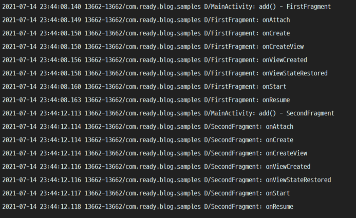

# 생명주기 콜백 함수 순서

- onAttach()
- onCreate()
- onCreateView()
- onViewCreated()
- onStart()
- onResume()
- onPause()
- onStop()
- onDestroyView()
- onDestroy()
- onDetach()

# onAttach()

프래그먼트가 생성이 될때 최초로 한번만 호출된다.

액티비티에서는 onCreate() 부터 context 사용이 가능했지만,
프래그먼트에서는 onAttach() 부터 가능하다.

# onCreate()

액티비티와 마찬가지로 변수는 여기서 초기화 해야한다.(arguments, savedInstanceState 등)

**View 생성은 이 다음단계인 onCreateView()에서 호출해야한다.**

# onCreateView()

Binding 및 레이아웃 inflate를 해야하는 단계이며 해당 view를 return 해주어야한다.
또한, onCreateView()가 호출되기 바로 직전에 viewLifecycleOwner가 생성된다.

# onViewCreated()

onCreateView()에서 반환한 View를 인자로 받아서 사용할 수 있으며,
이 단계에서 View를 초기화 하거나, viewPager2, list adapter 및 LiveData 옵저빙을 해주는 단계이다.(viewLifecycleOwnerLiveData를 사용하여 옵저버를 생성한다면 onCreate()에서 구현할 수 있다.)

# onStart()

화면에 프래그먼트가 표시될 때 호출되며, 이 때부터 childFragmentManager를 통해 프래그먼트 트랙잭션을 사용한다.

# onResume()

사용자에게 프래그먼트의 뷰들이 보이면서 재생하던 애니메이션이 종료되고 사용자와 상호작용이 가능한 단계이다.

# onPause()

프래그먼트는 보이지만 포커싱이 없어진 상태다.

# onStop()

프래그먼트가 더이상 화면에 보이지지 않을때 호출되며,
주로 사용자가 홈키를 눌렀을때 이 단계까지 호출된다.

주의할 점은 앱이 백그라운드에 있기 때문에 오랫동안 onStop() 상태일 경우 메모리 부족현상이 나타날때 destroy 될 수 있다.

# onDestroyView()

프래그먼트의 View들이 전부 소멸되고 프래그먼트의 객체는 여전히 살아있으며,
만약 binding을 사용중이라면, 메모리 누수를 방지하기 위해 `binding = null` 처리를 해줘야한다.
이는 공식 가이드에서도 권장하고 있으며, binding 객체를 null로 해줘야 가비지컬렉터에서 수집해갈수있다.

```
class BlankFragment : Fragment() {

    private var _binding: FragmentBlankBinding? = null
    private val binding get() = _binding!!

    override fun onCreateView(
        inflater: LayoutInflater, container: ViewGroup?,
        savedInstanceState: Bundle?
    ): View {
        _binding = FragmentBlankBinding.inflate(inflater, container, false)
        return binding.root
    }

    override fun onDestroyView() {
        super.onDestroyView()
        _binding = null
    }
}
```

위 코드의 단점은 binding 변수를 두개를 가져야 하며 null 처리를 직접 관리 해야한다는 점이다.

이 단점을 보완한 방법이 있지만, 주제에 벗어나는거같아 그냥 넘어가겠다.

또한, viewLifeCycle의 마지막 생명주기이다.(밑에서 설명)

# onDestroy()

프래그먼트가 소멸되기 직전에 호출된다.

# onDetach()

프래그먼트가 액티비티와 연결이 끊겼을때 호출됩니다.

# 로그 테스트

1. Fragment 위에 Fragment를 add 하는 경우
  - 
2. Fragment를 replace 하는 경우 1(addToBackStack X)
  - 
3. Fragment를 replace 하는 경우 2(addToBackStack O)
  - 
  
## 로그 테스트 2번과 3번의 큰 차이점

- 2번의 경우 addToBackStack을 안한 경우이며, replace 되었을때 onDetach() 까지 호출되어 소멸한다.
- 3번은 addToBackStack을 했을 경우다. 프래그먼트가 replace 되더라도 백스택에 쌓여있기 때문에 onDestroyView() 까지만 호출이 된다.

# 참조문헌 References

- [준비된 개발자](https://readystory.tistory.com/199)
- [pluu](https://pluu.github.io/blog/android/2020/01/25/android-fragment-lifecycle/)