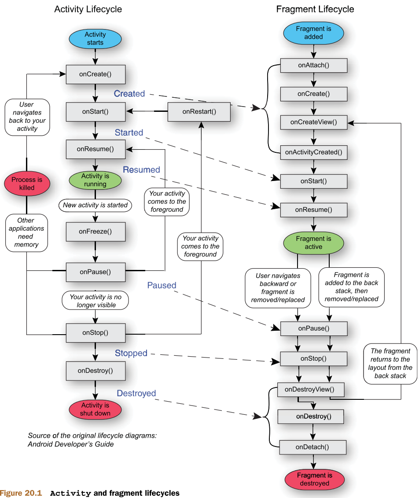
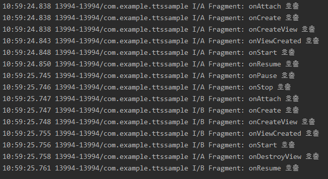
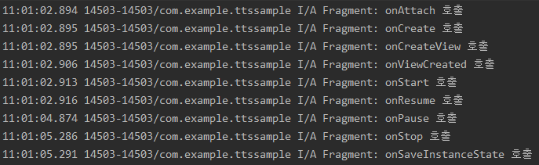

## Life Cycle (Activity, Fragment)
- Activity 와 Fragment 의 Life Cycle 은 Created, Started, Resumed, Paused, Stopped, Destroyed 단계로 구분할 수 있습니다.
- 아래에서는 Activity 에 Fragment 가 있는 상황을 가정하여, 각 단계에 대한 Activity 와 Fragment 의 Life Cycle 을 동작 순서에 맞춰 서술하겠습니다.



## Created
Fragment onAttach() 호출

- Fragment 가 Activity 와 연결될 때 호출
- Fragment 가 완벽하게 생성된 상태는 아니며, 종속될 Activity의 Context 를 인자로 받는다.
 
 Fragment onCreate() 호출

- Activity 에서 Fragment 를 호출하여 생성될때 호출
- Activity Bundle 을 인자로 받아서 리소스를 초기화
- View 가 생성되기 전으로 UI 는 초기화 하면 안된다.

Activity onCreate() 호출

- 액티비티에서 한번 발생하는 기본적인 Application구동 로직이 일어남
- 데이터를 리스트에 묶거나, 뷰모델에 연결시키거나, 클래스의 변수를 인스턴스화 함 (클래스로부터 객체를 생성)

Fragment onCreateView() 호출

- Fragment 에서 UI 를 그릴 때 호출되는 콜백
- Layout 을 inflate 하고 view 객체를 생성해서 반환함. UI 관련 바인딩 작업을 할 수 있음
- Fragment 가 위치하게 될 Activity 의 ViewGroup 인 container 가 매개변수로 전달됨
- savedInstanceState 는 Bundle 객체로 Fragment 가 재개되는 경우 이전 상태에 대한 데이터가 저장되어 제공된다.

Fragment onActivityCreated() 호출

- Activity 의 onCreate() 실행이 끝난 다음에 호출
- Activity 와 Fragment 의 View 가 모두 생성된 상황으로 View 의 변경이 가능해짐

## Started
Fragment 의 onStart() 호출

- Activity 와 같이 Fragment 가 화면에 보여지기 직전 빠르게 실행되며, 이때 Activity 는 시작되어있는 상태

Activity 의 onStart() 호출

- 사용자에게 액티비티가 보여지고, 상호작용이 가능하도록 만듬

## Resumed
Activity 의 onResume() 호출

- 포커스가 다른 앱으로 넘어가기 전까지 머물러 있는 단계로, Foreground 에서 사용자에게 보이는 동안 실행해야 하는 모든 기능을 활성화

Fragment 의 onResume() 호출

- Activity 와 마찬가지로 사용자와 상호작용이 가능한 시점으로, 다른 이벤트가 발생하여 fragment 가 가려지기 전까지 이 상태가 유지됨

## Paused
Activity 의 onPause() 호출

- 사용자의 포커싱이 옮겨진 경우, 멀티 윈도우로 실행된 경우, 다이얼로그 창이 위에 뜬 경우 onPause 상태로 들어감
- 잠깐 실행되는 메서드로 Application 데이터 저장이나 네트워크 호출 등의 작업은 하면 안된다.
- 시스템의 리소스를 해제할때는 사용 가능 (Broadcast Receiver 의 해제 등)

Fragment 의 onPause() 호출

- 다른 Activity 가 위로 올라오거나 다른 Fragment 가 add 되는 경우 호출
- UI 관련 처리를 정지하고 데이터를 저장한다. 

## Stopped
Activity 의 onStop() 호출

- Activity 가 더 이상 사용자에게 보이지 않을 때, onStop 상태로 들어온다.
- 앱이 사용자에게 보이지 않을 때 어떤 리소스를 해제하거나 조정해줄지 결정
- Activity 가 onStop 에 들어가면 activity object 를 메모리에 저장하여 다시 실행 되었을때도 정보가 유지되게 함
- onStop() 이 호출된 뒤 onSaveInstanceState() 가 호출되어 데이터를 저장

Fragment 의 onStop() 호출

- Fragment 에서도 부모 Activity 나 Fragment 가 화면에 가려지거나 중단되었을 때 호출된다.
- onSaveInstanceState() 를 이용하여 데이터를 저장
> **주의:** **API 28** 버전부터 onStop() 과 onSaveInstanceState() 의 순서가 바뀌었음
- API 28 버전부터 onStop() 이 onSaveInstanceState() 함수보다 먼저 호출됨으로써 onStop() 이 Fragment 의 동작을 안전하게 수행할 수 있는 마지막 지점이 되었음

## Destroyed
Activity 의 onDestroy() 호출

- Activity 가 완전히 종료되거나, 화면전환, 멀티윈도우 모드 같이 시스템이 잠시 꺼졌다가 다시 켜지는 경우 호출
- Viewmodel 을 사용하여, 화면회전과 같이 Activity 가 재생성될때는 그 전 액티비티에서 다음 액티비티로 데이터를 넘겨주고, 재생성 되지 않고 제거될 때는 viewmodel 의 onCleared() 함수를 사용하여 데이터를 모두 제거해주면 된다.

Fragment 의 onDestroyView() 호출

- Fragment 와 관련된 view 가 제거될 때 실행
- Activity 에서 Fragment 생성 시, addToBackStack() 을 요청했을 경우에는 onDestroy() 를 호출하지 않고 인스턴스에 저장되어 있다가 Fragment 를 다시 생성하면 onCreateView() 를 실행하여 다시 화면에 보여줌
- 해당 시점에서는 Garbage Colletor (GC) 에 의해 수거될 수 있도록 Fragment View 에 대한 모든 참조가 제거되어야 함 그렇지 않으면 메모리 누수 (Memory Leak) 가 발생할 수 있음

Fragment 의 onDestroy() 호출

- Fragment 가 제거되거나 FragmentManager 가 Destroy 되었을 경우, 프래그먼트의 Life Cycle 은 destroyed 상태가 되고, onDestory() 가 호출 됨.

Fragment 의 onDetach() 호출

- Fragment 가 완전히 소멸되고 Activity 와 연결이 끊어질 때 실행

지금까지 Activity 와 Fragment 의 기본적인 생명주기에 관해서 알아보았습니다.
그렇다면 Activity 나 Fragment의 재시작, Fragment 의 교체, Fragment 의 재시작 시에는 어떤 순서로 동작 되는지에 대해서도 알아보겠습니다.

---

### Fragment 위에 Fragment  를 add  하는 경우


- 첫번째 Fragment 의 onAttach() ~  onResume() 까지 실행되고 두번째 Fragment 의 onAttach() ~ onResume() 까지 실행됨. 이때 아래에 있는 FirstFragment 의 Life Cycle 은 여전히 실행되고 있는 상태입니다.

### 새로운 Fragment 를 replace  하는 경우


- 첫번째 Fragment 의 onAttach() ~ onResume() 까지 호출된 다음 replace 동작이 호출됨
- 첫번째 Fragment 의 onStop() 까지 호출된 다음 두번째 Fragment 의 onAttach() 부터 onStart() 까지 호출됨
- 첫번째 Fragment 의 onDestroyView() ~ onDetach() 까지 호출되고 두번째 Fragment 의 onResume() 이 호출됨

###  Fragment 를 replace 하면서 addToBackStack() 하는 경우



- 첫번째 Fragment 의 onAttach() ~ onResume() 까지 호출된 다음 replace 동작이 호출됨
- 첫번째 Fragement 의 onStop() 까지 호출된 다음 두번째 Fragment 의 onAttach() 부터 onStart() 까지 호출됨
- 첫번째 Fragment 의 DestoryView() 만 호출된 다음 두번째 Fragment 의 onResume() 이 호출됨
- 그냥 replace 하는 것과 달리 backstack 에 첫번째 fragment 를 남기기 때문에 onDestroyView() 까지만 호출됨을 알 수 있습니다.

### Home 버튼을 통해 화면을 나간 경우



- onAttach() 부터 onResume() 까지 호출된 다음 Home 버튼을 누르면 onPause() ~ onSaveInstanceState() 까지 호출되면서 그 뒤는 호출되지 않음
- 하지만 onStop() 에 있는 동안 메모리 부족 등에 경우 시스템에 의해 Destroy 될 수 있습니다.

메모리 부족으로 인해 앱이 강제종료 되는 부분은 시스템이 알아서 결정을 하는데, 개발자는 앱을 만들때 앱의 라이프사이클 처리에 신경을 써서 앱을 종료하거나 다시 실행할때 그 동작이 제대로 이루어지도록 설계해서 메모리 누수가 없도록 앱을 설계해야 합니다.
시스템의 메모리 누수가 일어나는 원인은 다양한데

- viewModel 에서 Activity 의 context 나 Activity 의 view 를 참조하는 것으로 메모리 누수가 일어날 수 있음 
- -> 뷰모델이 특정 액티비티 인스턴스보다 더 오랜 수명을 가질 수 있기 때문에 메모리 누수가 일어날 수 있음
- viewBinding 사용 시 Fragment  에서 메모리 누수 
- -> Fragment 의 onDestroyView() 에서 null 처리를 해주지 않으면 fragment 내의 view의 생명주기가 fragment 보다 더 오래 유지 되기 때문에 메모리 누수가 생길 수 있음
- 서비스가 필요하지 않을 시에도 실행되도록 놔두는 것으로 메모리 부족이 일어날 수 있음 
- -> 강제 종료에 대비해서 onStartCommand 또는 onBind 에서 강제 종료 후에 해야하는 동작을 설정하는 것으로 메모리 누수에 대비할 수 있음

등이 있습니다.
그렇다면 메모리 누수란 정확이 어떤 것인지 알아봅시다.

# 메모리 누수와 사용자가 겪을 수 있는 불편 사항
## 메모리 누수 (Memory Leak) 이란?
- Application 은 동작을 위한 메모리가 필요한데, Application 이 사용이 끝난 메모리를 반환하지 않은 경우를 메모리 릭 또는 메모리 누수 라고 합니다. 사용한 메모리를 반환하지 않은 채, 추가로 필요한 메모리를 시스템에 요청하기 때문에 사용하는 메모리의 양이 계속 증가합니다. 그 결과 OOM (Out Of Memory) 를 발생 시키고 Application이 강제 종료 되면서 Application에 할당된 메모리가 시스템으로 회수됩니다.

안드로이드 시스템에서는 가비지 콜렉터 (Garbage Colletor, GC) 를 이용하여 런타임에서 메모리가 부족한 경우에 Application을 원할하게 동작하게 할 메모리를 확보합니다. 가비지 콜렉터의 동작은 3단계로 이루어지는데
1) 메모리에 있는 모든 객체 참조를 나열해서 참조가 있는 활성 객체를 표시
2) 활성 객체를 제외한 객체들을 메모리에서 제거
3) 남아있는 객체를 재정렬
위의 과정을 통해서 메모리를 확보해주는데 메모리 누수로 인해 충분한 메모리를 확보할 수 없는 경우에는 다음의 현상이 사용자에게 일어날 수 있습니다.

1) 앱 버벅거림 현상 - 메모리가 부족할 때 동작하는 가비지 콜렉터(GC) 가 자주 동작하여 앱 버벅거림으로 이어집니다. 가비지 콜렉터가 동작하는 순간 안드로이드의 UI 렌더링이나 이벤트 처리를 중지 시키게 되는데 이때 사용자는 앱이 멈추는 듯한 현상을 겪을 수 있습니다.
2) 앱 중단 - 앱의 응답을 액티비티 매니저와 윈도우 매니저 시스템 서비스로 항상 모니터링 하고 있는데 5초 이내에 입력이벤트가 없거나 broadcastReceiver  가 10초 내에 실행을 완료하지 않으면 ANR 다이얼로그를 띄우면서 앱이 중단됩니다. 메모리가 부족하여 시스템에 과부하가 일어난다면 최악의 경우 사용자는 앱이 중단되는 현상을 겪을 수 있습니다.

위와 같은 현상은 사용자가 앱 사용중에 겪을 수 있는 최악의 현상들 중 하나로 개발자는 위와 같은 현상을 방지하기 위해 앱 개발시에 메모리 관리에 신경을 써야 합니다.

그렇다면 앱을 개발할때에 생명주기만 신경을 쓴다면 메모리 누수를 막을 수 있을까요?
정답은 아니오 입니다. Life Cycle 외에도 Context 를 사용함에 있어서도 메모리 누수가 발생할 수 있습니다.

# Context 와 메모리 누수
## Context 란?
- **Context** 는 Application 환경에 대한 인터페이스로, Application의 현재상태를 Context 를 통해 표현합니다. 
-  Context 라는 클래스가 Application 리소스와 시스템 서비스 등에 접근할 수 있는 메소드들을 가지고 있습니다.
- Activity, Service, Application 등은 Context 라는 추상클래스를 상속받은 구현체로, 앱 내에서는 여러개의 Activity 가 존재할 수 있기 때문에 Activity Context 도 여러 개 생길 수 있지만 Application은 하나 이므로 Application Context 는 1개만 존재할 수 있음.

### Application Context
- 안드로이드 Application 자체이며, Application의 상태를 표현함
- Application Context 는 Application의 생명주기와 묶여 있어서, Activity 범위보다 큰 Context 를 전달할 때 사용됨
- Application의 범위는 Activity 보다 크기 때문에 만약 Application 내에서 Activity 를 참조하게 되면 메모리 누수가 발생합니다.
- 앱에서 데이터베이스를 관리하는 DataBase 클래스가 Singleton  으로 존재한다면 Application Context 를 참조해야 함.
- DataBase 클래스는 싱글톤으로 생성되어 있기 때문에 만약 Activity Context 를 참조한다면 메모리 누수를 일으키게 됨

### Activity Context
- Activity 를 표현하는데 사용됨. 이 Context 는 Activity 의 Life Cycle 에 묶이기 때문에, Activity 범위 내에서 Context 를 전달하거나 현재 Context 에 Life Cycle 이 엮여있는 경우에만 사용
- GUI 와 관련되어 다이얼로그를 띄우는 등의 동작은 Activity Context 를  참조하여야 정상적으로 동작함.

## Context 의 획득 및 사용
- Context 는 일반적으로 뷰 (Toast, Adapter, Inflaters), 액티비티 실행 (Intents), 시스템 서비스 접근 (SharedPreferences, ContentProviders) 등에 사용
- 앱 리소스 모음 : res, assets, 스토리지
- 시스템 서비스 접근 : SystemServices
- 앱 정보 가져오기 : ApplicationInfo
등에 Context 가 사용된다. 그러면 Context 를 어떻게 가져올 수 있을까?

### Context 를 얻는 3가지 방법
1) **View**
- View 클래스에서 제공하는 getContext() 는 뷰에 있는 Activity 의 Context 를 가져다줍니다. Application Context 가 아닌 Activity Context 이기 때문에 특정 Activity 의 UI 변화와 관련되어 있음. Activity  Context 는 View  를 관리하는데 쓰이며 layout 을 inflate 하고 dialog 를 보여주는 단기적 작업에 사용됨

2) **Activity**
- Activity 는 Context 를 상속받은 하위 클래스로, getApplicationContext() 메서드로 Application Context 를 가져올 수 있음
- Application Context 는 백그라운드 작업, 데이터 액세스 와 같이 Activity 의 LifeCycle 에 국한되지 않고 유지되어야 하는 작업을 할 때 사용됨

3) **ContentWrapper**
- getBaseContext() 라는 메소드가 있지만 잘 사용되지 않음

## Context 와 메모리 누수
Context 를 이용함에 있어서도 메모리 누수가 발생할 수 있는데, 그 원인과 대처 방안은 다음과 같다.

1) **Static 변수**
```
var test : View? = null

class MainActivity : AppCompatActivity() {
	override onCreate(savedInstanceState : Bundle?){
		super.onCreate(savedInstanceState)
		// View 가 Activity Context 를 참조
		test = View(this)
	}
}
```
- View 에 대한 변수를 Static 으로 선언해두고, 변수가 Activity Context 를 참조하도록 만든다면, Application이 계속 실행될때, activity 가 destroy 되어도 해당 activity context 에 대한 참조가 있으므로 메모리가 해제되지 않는 문제가 생김
```
override onDestroy(){
	super.onDestroy()
	test = null
}
```
- onDestroy() 내에서 수동으로 변수를 null 로 만들어주면 메모리가 해제 됨

2) **Singleton**
- Singleton  을 사용할 때 Activity Context 를 참조한다면 비슷한 문제가 발생하는데, 대신 Application Context 를 사용하면 된다.
- MVC, MVP, MVVM 등 적절한 아키텍쳐로 View  와 분리를 하여 Activtiy Context 에 대한 접근이 필요없게 만들면 이러한 문제를 해결 할 수 있음

3) **Inner Class**
- Activity 안에 만들어진 내부클래스는 상위 Activity  의 Activity Context 를 참조함
- Singleton 과 비슷한 맥락으로 내부 클래스를 Object 로 만든다면 문제가 발생하지 않음

4) **Background**
- 비동기 작업은 Activity 가 종료된 뒤, 백그라운드에서 계속 실행되므로 Activity 에 접근 할 수 있음.
- AsyncTask 와 같이 Activity 내부에서 생성되는 코드는 내부 클래스를 만드는것과 같은 문제가 발생할 수 있지만 별도 클래스에 넣어서 해결할 수 있고, Thread 를 사용함에 있어서 발생할 수 있는 비슷한 문제는 Activity 가 onDestory() 될 때 Thread 를 중단하면 문제가 해결된다. 또한 비동기 처리를 할때는 Coroutine 을 사용하면 문제가 해결된다.

5) **이벤트 핸들링**
- 시스템 서비스의 이벤트를 처리하기 위해 Activity 에 리스너가 등록된 경우 Activity 가 종료될 때 등록을 취소하면 문제가 해결됨
- 이번에 보안작업을 하면서 USB 가 연결되면 로그를 찍는 broadcastReceiver 를 등록하는 작업이 있었는데, 이때도 Activity 가 종료될때, 리스너를 해제해주어 메모리 누수를 막았음


---
### 참조문헌 References
- https://jinee0717.tistory.com/44
- https://hik-coding.tistory.com/72?category
- https://readystory.tistory.com/199
- https://woovictory.github.io/2019/05/02/What-is-ViewModel/
- http://wanochoi.com/?p=1990
- https://developer.android.com/topic/performance/memory?hl=ko
- https://developer.android.com/topic/performance/memory-overview?hl=ko
- https://mparchive.tistory.com/190
- https://velog.io/@hanna2100/%EB%B2%88%EC%97%AD-%EC%95%88%EB%93%9C%EB%A1%9C%EC%9D%B4%EB%93%9C%EC%9D%98-Context%EC%99%80-%EB%A9%94%EB%AA%A8%EB%A6%AC%EB%88%84%EC%88%98
- https://medium.com/swlh/context-and-memory-leaks-in-android-82a39ed33002
- https://charlezz.medium.com/%EC%95%88%EB%93%9C%EB%A1%9C%EC%9D%B4%EB%93%9C%EC%9D%98-context%EB%A5%BC-%EC%9D%B4%ED%95%B4%ED%95%98%EA%B3%A0-%EB%A9%94%EB%AA%A8%EB%A6%AC-%EB%88%84%EC%88%98%EB%A5%BC-%EB%B0%A9%EC%A7%80%ED%95%98%EA%B8%B0-b092a09ef4ef
