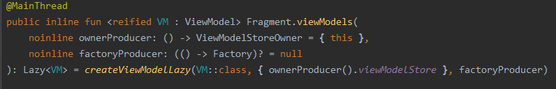
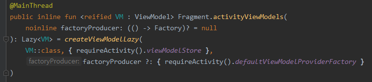

# Sample Project
### 로또 번호 추첨기
- 안드로이드 Activity 와 Fragment 그리고 viewModel 의 life cycle 을 공부하며, life cycle 을 관리하면서 만들어 볼 수 있는 간단한 샘플 코드로  로또 번호 추첨기를 선택하였습니다.
- 1개의 Main Activity 와 2개의 Fragment 그리고 Main Activity 를 호스트로 하여  두개의 서로 다른 Fragment 에서 데이터를 공유하기 위해서 하나의 ViewModel 을 사용하였습니다.

### Life Cycle 과 ViewModel
- 로또 번호 추첨기 코드는 내 로또 번호를 확정하는 LottoFragment 와 확정된 내 로또 번호와 당첨 번호를 비교하는 ResultFragment 가 있습니다.
- 두 개의 서로 다른 Fragment  에서 내 로또 번호를 공유해야 하는 문제가 있었습니다. 만약 서로 다른 Fragment 에서 각자 ViewModel 을 생성한다면, 각각의 ViewModel 들은 각 Fragment 가 detach 되고 나서 사라져 버리기 때문에 서로 같은 데이터를 공유하는게 불가능합니다.

---

그렇다면 MainActivity 의 ViewModel 에서 하나의 데이터를 관리하고 각각의 Fragment  에서 그 데이터를 가져다 쓰면 되지 않을까? 라고 생각했습니다. 하지만 주의할 점이 있었습니다. Fragment 에서 ViewModel 을 초기화할때 
```
private val mMainViewModel : MainViewModel by viewModels()
```
라고 delegate Pattern 을 통해 위임을 한다면 ViewModel 은 각각의 Fragment 에 종속되어 생성되며, Fragment 가 사라진다면 Fragment 의 ondetach() 가 호출되고 나서 ViewModel 의 onCleared() 가 호출됩니다. 이렇게 ViewModel 이 생성될 때 각각의 다른 Fragment 에서 호출하였다면, 동일한 ViewModel 을 호출하였더라도, 각각 다른 객체가 생성되기 때문에 서로 데이터를 공유하는게 불가능합니다. 그렇기 때문에
```
private val mSharedViewModel : SharedViewModel by activityViewModels()
```
를 사용하여 MainActivity 에서 하나의 ViewModel 을 만들고 각 Fragment 에서 동일한 ViewModel 을 공유하여, 데이터 전송이 용이하도록 만들었습니다.

---
그렇다면 왜 by viewModels() 를 쓰면 서로 다른 객체인 viewModel 이 생성되는 걸까? 라고 생각을 한 뒤 viewModels() 와 activityViewModels() 를 각각 타고 올라가보니 차이점이 있었습니다.

by viewModels()



by activityViewModels()



위와 같이 viewModels() 에는 ViewModelStoreOwner = {this} 라고 명시되어 있고, activityViewModels() 에는 그 부분이 없는 것을 볼 수 있습니다. 이를 통해서 by viewModels() 를 사용하면, 사용된 Activity 나 Fragment 의 Life Cycle 을 따르는 각각 다른 viewModel 이 생성되기 때문에 데이터를 공유할 수 없습니다. 하지만 activityViewModels() 를 쓴다면 이미 생성되어 있는 SharedViewModel 과 같은 ViewModel 이 생성되기 때문에 데이터 공유가 가능해집니다.

---

### Call by Reference, Call by Value
- 샘플 프로젝트를 만들면서 하나 더 공부할 수 있는 부분이 있었습니다.
- 바로 Call by Reference, Call by Value 부분인데, 문제를 겪은 부분은 다음과 같습니다.
---

SharedViewModel 에서 setLottoNumber 함수를 통해서 뽑은 로또 넘버를  SharedViewModel 의 mLottoNumber 변수에 저장하도록 만들었습니다. 하지만 ResultFragment 에서 당첨된 번호를 뽑는 경우에 같은 LottoUtils 의 함수를 사용하기 때문에 그 전에 내 번호를 뽑았던 부분과 주소값이 겹쳐서 이미 가지고 있던 내 번호가 바뀌어버리는 문제가 생겼었습니다. 그건 바로 SharedViewModel 에서 setLottoNumber 함수에서
```
fun setLottoNumber(lottoNumber : List<Int>){mLottoNumer = lottoNumber}
```
로 선언을 해두어서 인데, 이 부분을
```
fun setLottoNumber(lottoNumber : List<Int>) {mLottoNumber = lottoNumber.toMutableList()}
```
이런식으로 주소값이 아닌 value 를 복사하도록 만들어주니 문제가 해결되었습니다. 그렇다면 Call by Reference 와 Call by Value 에는 어떤 차이가 있을까요?

### Call by Reference (참조에 의한 호출)
- 인자로 받은 값의 주소를 참조하여 직접 값에 영향을 줌
- 복사하지 않고 직접 참조를 하기 때문에 메모리 낭비가 적고 처리속도가 빠르다.
- 직접 참조를 하기 때문에 원래의 값이 바뀔 수 있음

### Call by Value (값에 의한 호출)
- 인자로 받은 값을 복사하여 처리함
- 복사를 하기 때문에 메모리의 사용량이 늘어남
- 복사하여 처리하기 때문에 원래의 값이 영향을 받지 않고 안전함


## References 참고문헌
- https://velog.io/@sysout-achieve/Android-Fragment%EA%B0%84-%EB%8D%B0%EC%9D%B4%ED%84%B0-%EC%A0%84%EB%8B%AC-%EB%B0%A9%EB%B2%95%EB%93%A4
- https://kotlinworld.com/88?category=971011
- https://developer.android.com/guide/fragments/communicate
- https://codingplus.tistory.com/29
- https://velog.io/@ahnick/Java-Call-by-Value-Call-by-Reference
