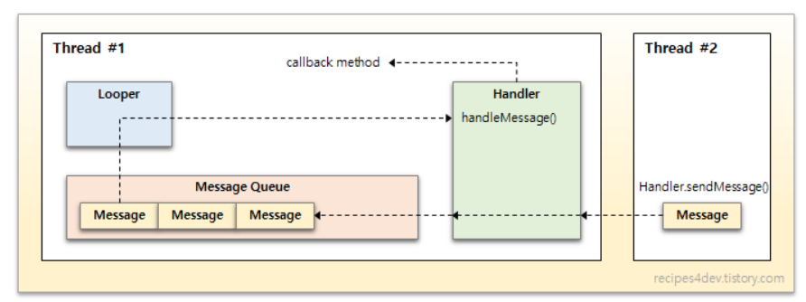

# Android Thread
 - 프로세스 내에서 순차적으로 실행되는 실행 흐름의 최소 단위이다.
## Main/UI Thread
- 어플리케이션을 실행하면 안드로이드 시스템이 그 어플리케이션에 대한 스레드를 생성한는데, 이를 메인 스레드라고 한다.
- UI와 어플리케이션이 상호작용하는 스레드이다.
- 안드로이드의 컴포넌트들은 기본적으로 UI Thread에서 시작되기 때문에 시스템 콜백에 응답하는 메소드 또한 항상 UI Thread에서 실행된다.
## Worker/Background Thread

- 우리가 앱을 사용할 때 많은 UI 이벤트를 발생시키는데 이 때 앱이 사용자와 상호작용 과정 중에서 리소스(네트워크 통신이나 DB 쿼리 등)를 많이 소모해야하는 경우 싱글 스레드로 구현하게 된다면 낮은 성능을 보이거나, 이로 인해 **ANR**이 발생하는 경우가 생기는 심각한 문제가 발생할 것이다. 그래서 UI Thread는 오직 UI와 관련된 처리만 할 수 있도록 하고 UI Thread가 차단하고 있는 작업들에 대해 대신 처리를 해주는 별도의 스레드를 생성해야 하는데 그 역할을 Worker Thread가 한다.

# Android Handler
> 네트워크 작업이 UI 변경으로 이어지는 작업을 해야 할 때는 어떻게 해야 할까?
> 예를들어 서버로부터 받은 이미지를 화면에 뿌려줘야 한다고 가정하자. 이때 Worker Thread는 서버로부터 이미지를 받아오는 것까지의 작업을 하고, 그 이미지에 대한 데이터를 UI Thread에 넘겨 UI Thread가 화면에 그려내게 한다. 이러한 작업들은 대표적으로 Handler와 AsyncTask로 작업을 처리한다.

- 핸들러는 스레드의 메시지큐(MessageQueue)와 관련된 Message와 Runnable 객체에 대해 전송하거나 실행할 수 있게 해준다.
- 핸들러 인스턴스는 핸들러 인스턴스를 생성하는 스레드와 그 스레드의 메시지큐와 연관되어 있는데, 바로 이 때문에 핸들러가 그 메시지큐에 Message나 Runnable을 전달하기도 하고, 메시지큐에서 꺼내 실행하기도 할 수 있다.

- 위 그림을 보면, Thread #1에서 생성된 Handler 객체가 Thread #1의 Looper와 Message Queue에 관련되어 있음을 알 수 있다. 그리고 Thread #2에서는 Thread #1의 Handler를 통해 MessageQueue에 작업(Message or Runnable)을 전달할 수 있다.

- 핸들러의 역할
	1. 다른 스레드에서 수행되어야 하는 작업을 Message Queue에 enqueue
	2. 미래 특정 시점에 실행되어야 하는 Message나 Runnable 객체 스케줄링

- 핸들러가 처리하는 작업 단위로 Message와 Runnable이 있는데, 이 두 객체에 대해 MessageQueue 스케줄링을 지원하는 메소드가 각각 분리되어 있다.
	1. Message : sendMessage(), sendEmptyMessage(), sendMessageAtTime(), sendMessageDelayed() 등
	2. Runnable : post(), postAtTime(), postDelayed() 등

- 이렇게 MessageQueue에 들어가 있는 Message 객체들을 꺼내어 실행하는 것이 handleMessage() 메소드이다. 꺼내온 Message에 대해 어떻게 처리할 것인가에 대해 구현이 되어있지 않기 때문에, 사용자가 반드시 재정의 해야한다.
- Runnable 객체는 객테 자체가 어떤 행동을 정의했기 때문에 별도로 재정의해야하는 메소드 없이 post() 메소드로 처리하면 된다.

## 참고사이트
- https://readystory.tistory.com/50
- https://recipes4dev.tistory.com/170
- https://recipes4dev.tistory.com/166
- https://developer.android.com/guide/components/processes-and-threads?hl=ko
- https://developer.android.com/reference/android/os/Handler
