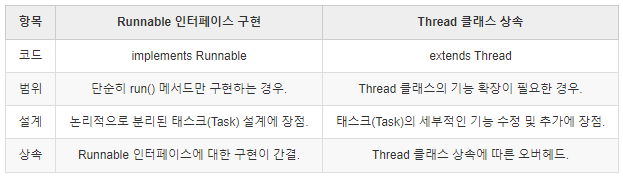

# 안드로이드 Thread
========================================================

- Thread 클래스를 사용하여 새로운 스레드를 생성하고 실행하는 방법은 크게 두 가지가 있다.
  1. Thread 클래스를 상속(extends)한 서브클래스(subclass)를 만든 다음, Thread클래스의 run() 메서드를 오버라이드(override)하는 것
  2. Runnable 인터페이스를 구현(implements)한 클래스를 선언한 다음, run() 메서드를 작성하는 것
  
# Thread클래스 상속
  - Thread 클래스를 상속(extends)한 클래스를 만들고 run() 메서드를 오버라이드(override)한 다음, 클래스 인스턴스를 생성하고 start() 메서드를 호출하는 것.
    
# Runnable 인터페이스 구현(implements)
  - Runnable 인터페이스를 구현(implements)하는 클래스를 선언하고 run() 메서드를 구현한 다음, 클래스 인스턴스를 Thread 클래스 인스턴스의 생성자에 전달하고 Thread 클래스 인스턴스의 start() 메서드를 호출하면 된다.
  
# Thread vs Runnable
  - 왜 쓰레드 구현을 2개의 방법으로 했을까?
    객체지향 프로그래밍에서 클래스를 상속한다는 것은, 부모 클래스의 특징을 물려받아 재사용하는 것을 기본으로, 부모의 기능을 재정의(override)하거나, 새로운 기능을 추가하여 클래스를 확장(extend)하는 것을 의미한다.
    그리고 이 내용을 달리보자면, 클래스(Class)의 기능을 재정의(override)하거나 확장(extend)할 필요가 없다면, 굳이 클래스(Class)를 상속하지 않아도 된다는 말이 된다. 즉 기존 클래스를 그대로 사용하면 되는 것이다.
    
    스레드를 실행하기 위해서는 Thread 클래스가 제공하는 기능을 사용해야 한다. 그리고 스레드로 실행될 메서드도 재정의(override)해야 한다.
    그래서 Thread 클래스를 상속(extends)하고 스레드 실행 메서드인 run() 메서드를 오버라이드(override)한 클래스를 만든 것이다.
    
    그런데 단지, run() 메서드 하나를 위해 Thread 클래스를 상속해야 할까?
    Thread 클래스의 다른 모든 기능들은 그대로 재사용(re-use)하는데, 무조건 오버라이드(override)되어야 하는 run() 메서드만을 위해서?
    Thread 클래스를 상속하지 않고, run() 메서드 코드만을 작성해서 Thread의 start() 메서드로 전달할 수 있으면 좋을때도 있을것이다.
    게다가, 프로그램 설계에 따라, run() 메서드를 구현할 클래스가 반드시 Thread가 아닌 다른 클래스를 상속해야 한다면, 다중상속이 허용되지 않는 자바에서 Thread 클래스를 상속(extends)하여 스레드를 만드는 것이 불가능해진다.
    
    이런 문제들을 해결하기 위해 개발자가 선택할 수 있는 방법은 무엇일까? 스레드 생성 시 반드시 구현해야 할 run() 메서드를 Thread 클래스와 분리하고 그 구현을 강제하는 것,
    그리고 추상화되어 있는 메서드를 클래스에서 구현(implements)하도록 만듦으로써, 다중상속이 불가능한 자바에서 그와 유사한 효과를 낼 수 있도록 만드는 방법.
    바로, 인터페이스(Interface)를 사용하는 것이다. 그리고 그 인터페이스가 Runnable 인터페이스이다.
     
    정리하자면, 두 가지 방법 중 어떤 것을 선택할 것인지는 Thread 클래스 기능의 확장 여부에 따라 결정된다.
    단순히 run() 메서드만을 구현하는 경우라면 Runnable 인터페이스를 구현(implements)하고,
    Thread 클래스가 제공하는 기능을 오버라이드(override)하거나 확장해야 한다면 Thread 클래스를 상속(extends)하는 방법을 선택할 수 있다.
    
    

  - Thread상속으로 구현
    ````````
    class TimerThread : Thread
    {
        constructor() : super()
        constructor(_runnable : Runnable): super(_runnable)
    
        override fun run() {
            for (i in 0..10){
                try{
                    Thread.sleep(1000)
                    Log.i("aaaa", "${i}")
                }
                catch (_e : InterruptedException){
                    Log.i("aaaa", "${_e.message}")
                }
            }
        }
    }
    
    val timerThread = TimerThread()
    timerThread.start()
    ````````
    
  - Runnable로 구현
    ````````
    val timerThread2 = TimerThread(Runnable {
                for (i in 0..10){
                    try{
                        Thread.sleep(1000)
                        Log.i("aaaa", "${i}")
                    }
                    catch (_e : InterruptedException){
                        Log.i("aaaa", "${_e.message}")
                    }
                }
            })
    timerThread2.start()
    ````````
    
    
