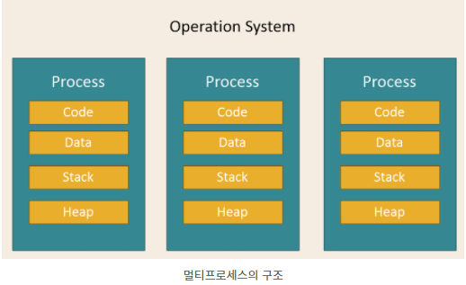
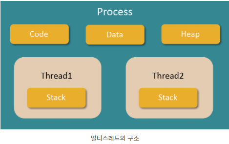
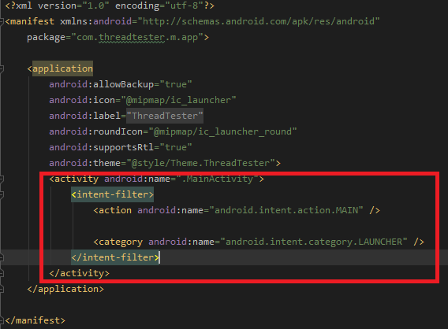
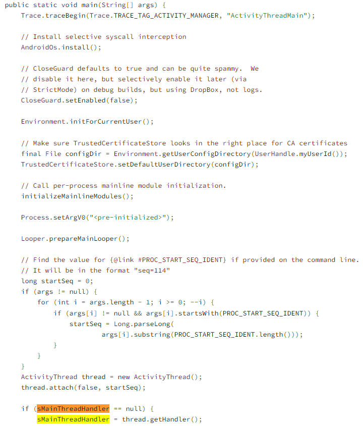
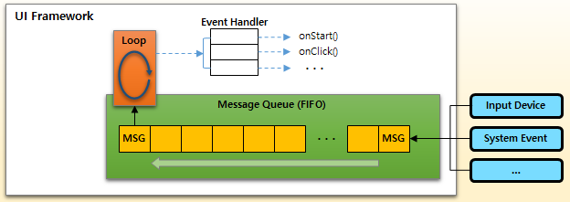
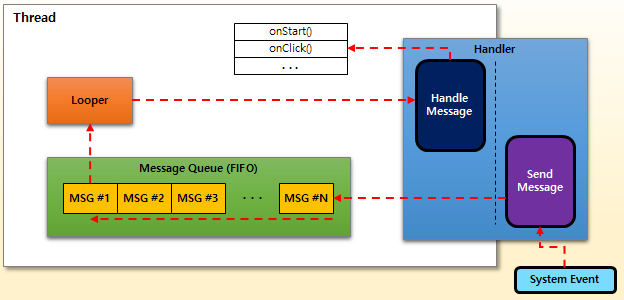
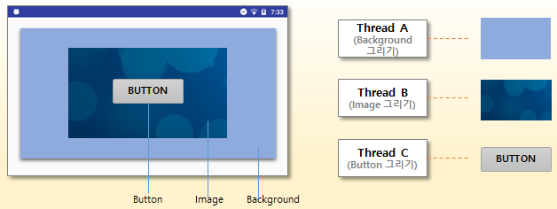

# Process와 Thread, 그리고 안드로이드에서 Thread 개념
========================================================

# 프로세스
  - 프로그램이 운영체제에 의해 논리적인 공간에서 실행된다.
    운영체제는 "여러 개의 프로그램이 동시에" 또는 "하나의 프로그램을 동시에 여러 개" 실행할 수 있게 해준다.
    이렇게 현재 메모리에 로딩되고, 실행 중인 프로그램을 프로세스라고 한다. ]
    
# 멀티프로세스

  - 하나의 컴퓨터에 여러개의 CPU가 장착되어 있다. 따라서 하나 이상의 프로세스를 동시에 처리하는것.
    장점 : 독립된 구조로 안정성이 높다.
           프로세스 중 하나에 문제가 생겨도 다른 프로세스에 영향을 주지 않는다.
    단점 : 독립된 영역이기 때문에 작업량이 많을수로 Context Switching이 자주 일어난다.
    
# 스레드
  - 한 프로세스에서 동작되는 실행의 흐름.
  
# 멀티스레드

  - 프로세스 하나에서 자원을 공유하면서 일련의 과정을 여러개 동시에 실행.
    장점 : 시스템 자원소모 감소 : 간단한 통신 방법으로 프로그램 응답시간 단축
           시스템 처리율 향상 : 스레드 간 데이터를 주고 받는 것이 간단해지고 시스템 자원 소모가 줄어든다
                               스레드 사이 작업량이 작아 Context Switching이 빠르다. 
           간단한 통신 방법으로 프로그램 응답시간 단축
           
    단점 : 자원을 공유하기에 동기화 문제가 발생
           디버깅이 어렵다 
           하나의 스레드에 문제가 생기면 전체 프로세스가 영향을 받는다
           
# Context Switching
  - CPU는 한번에 하나의 프로세스만 실행 가능하다. CPU에서 여러 프로세스를 돌아가면서 작업을 처리하는 데 이 과정을 Context Switching라 한다.
    동작 중인 프로세스가 대기를 하면서 해당 프로세스의 상태(Context)를 보관하고, 대기하고 있던 다음 순서의 프로세스가 동작하면서 이전에 보관했던 프로세스의 상태를 복구하는 작업을 말한다.
    
# Main Thread
  - 스레드가 각각의 독립적인 실행 흐름을 나타낸다고 하더라도, 프로세스가 실행될 때 모든 스레드가 한번에 실행되지는 않는다. 
    스레드는 프로세스 실행 중 언제든지 필요에 따라 만들어지고 실행될 수 있는데, 이는 기존에 이미 실행 중인 스레드에 의해서 수행될 수 있다.
    따라서 프로세스가 시작될 때, 최소 하나의 스레드가 실행된다. 보통 main() 함수라고 일컫는, 프로세스의 시작과 동시에 실행되는 스레드, 메인 스레드(Main Thread)이다.
    
# 안드로이드에서 Thread
  - 프로세스의 시작점인 main() 함수에서 시작되는 스레드를 메인 스레드라고 한다. 그런데 안드로이드 앱 프로젝트 소스를 보면 main() 함수를 찾을 수 없다. 스레드의 시작점이 되는 함수 자체를 찾을 수가 없다.
    그러면 안드로이드 앱에는 main() 함수가 존재하지 않는 것일까?
    만약 main() 함수가 존재하지 않는다면 앱의 시작점은 어디일까? 그리고 안드로이드 앱에는 메인 스레드가 없는 것일까? 그러면 새로운 스레드는 언제, 어디서 만들고 실행할 수 있을까?
    
# 안드로이드 앱의 시작점
  - 안드로이드는 앱에 포함된 액티비티 중 하나를 런처(Launcher)로 지정함으로써, 해당 액티비티를 앱의 시작점(entry point)으로 만들 수 있다.
  

    
    개발자가 main() 함수를 직접 구현하지 않아도 된다고 해서, 안드로이드에 main() 함수가 존재하지 않거나, 앱이 실행될 때 아무런 준비 과정 없이, 무작정 런처로 지정된 액티비티가 실행되는 것은 아니다.
    단지 개발자가 직접 main() 함수를 구현하지 않아도 된다는 것일 뿐, main() 함수와 그 실행 코드는 안드로이드 프레임워크(Framework)에 이미 구현되어 있다.
    안드로이드 프레임워크에서, main() 함수는 "android.app.ActivityThread" 클래스에 구현되어 있다.
    ActivityThread의 main() 함수에는 안드로이드 프레임워크(Framework) 상에서 앱의 동작에 필요한 여러 준비 동작을 수행하는데,
    그 중 가장 중요한 과정이 바로 메인 UI 스레드(Main UI Thread)를 실행하는 것이다. 그리고 런처(Launcher)로 지정된 액티비티를 찾아서 실행한다.
    
    

# 안드로이드 메인UI스레드
  - 사용자의 입력(키보드, 마우스, 터치 등)이 중요하게 취급되는 기기에서 하나의 프로그램이 실행되면, main() 함수의 시작부터 종료까지 선형적으로 실행되고 끝나는 경우는 없다.
    사용자 입력이 필수인 프로그램에서는 사용자 입력 이벤트를 처리하기 위한 루프(Loop)가 실행되어야 한다.
    그런데 루프(Loop)를 실행한다고 해서, 무작정 for 문이나 while 문을 실행하는 것은 아니다.
    루프(Loop) 안에서 사용자 입력이 들어올 때까지 대기해야 한다면 다른 이벤트를 처리할 수 없고, 단순히 사용자 입력이 존재하는지 여부를 체크만하고 지속적인 루프 실행을 반복한다면 그 자체가 시스템 자원을 소모시킬 수 있기 때문이다.
    
    UI 프레임워크는 메시지 큐(Message Queue)를 사용하여 루프(Loop)의 코드를 작성하도록 가이드한다.
    메시지 큐(Message Queue)는 FIFO 형식으로 동작한다. 메시지(Message)는 사용자 입력을 포함한 시스템의 모든 이벤트를 전달할 때 사용하는 객체이다.
    그러므로 스레드의 관점에서 메시지 큐(Message Queue)는 시스템 이벤트를 발생 순서대로 전달받아 처리하기 위해 사용하는 구조이다.
    
    시스템(또는 프로세스)에서 발생한 새로운 메시지가 메시지 큐(Message Queue)에 수신되면, 메시지가 담고 있는 내용에 따라 적절한 핸들러(Handler) 메서드가 호출된다.
    하지만 일반적인 응용 프로그램이, 시스템에서 발생 가능한 모든 이벤트를 처리할 필요는 없기 때문에, 보통, 자신이 관심을 가지는 이벤트에 대한 메시지를 핸들러로 등록하고 호출되도록 만든다.
    
        

    안드로이드 앱에서 시스템 이벤트를 처리하기 위한 루프(Loop)는 Looper라는 클래스를 통해 실행된다.
    루프(Loop)를 실행하고 그 루프(Loop) 안에서 메시지 큐(Message Queue)로 전달되는 메시지가 존재하는지 검사하한다.
    그리고 새로운 메시지가 도착하면, 해당 메시지를 처리할 핸들러(Handler) 메서드를 실행합니다.
    
    안드로이드의 핸들러(Handler)는, 이름 그대로, Handler 클래스가 담당한다.
    그런데 통상적인 개념에서 핸들러(Handler)는 메시지 수신 시 그 처리를 담당하는 역할만 수행하는데, 안드로이드에서 Handler는 메시지를 보내는 역할까지 포함한다.
    안드로이드의 Handler는 Looper가 가진 메시지 큐(Message Queue)를 다룰 수 있기 때문에, 새로운 메시지를 보내거나, 수신된 메시지에 대한 처리를 담당하는 주체가 되는 것이다.
    

# 안드로이드 메인 UI 스레드의 중요한 역할 : 화면 그리기.
  - 안드로이드 뿐만 아니라, 대부분의 "그래픽 사용자 인터페이스(GUI, Graphical User Interface)"를 가진 프레임워크(Framework)가 그러하듯, 프레임워크가 수행해야 할 가장 중요한 기능 중 하나는
    "다양한 구성 요소들을 화면에 그리는 것"이다. 그리고 프레임워크의 "그리기 기능"은 반드시 메인 UI 스레드에서만 실행되어야만 한다.
    
    "왜 화면 그리기 기능은 메인 UI 스레드에서만 실행되어야 하나? 여러 스레드에 나눠 실행하면 더 효율적이지 않나?" 라는 의문이 생길 수 있다.
    그 의문에 대한 답을 얻기 위해 아래와 같이, 하나의 색상으로 칠해진 배경 위에 이미지를 그린 다음, 또 그 위에 버튼이 올라간 형태의 화면을 표시하는 경우를 가정해 보자.
    
    만약 이 화면을 그리기 위해 여러 스레드를 사용한다면, 배경에 지정된 색을 칠하는 스레드 A, 이미지를 그리는 스레드 B, 그리고 버튼을 그리는 스레드 C로 나눌 수 있다.

    스레드가 실행되어 화면을 그려야 할 순간이 왔는데, 운이 좋게도 아래 그림의 첫 번째 결과처럼, A-B-C 순서대로 스레드가 순차적으로 실행된다면 우리가 원하는 화면을 볼 수 있다.
    하지만 상대적으로 작은 크기를 그려야 하는 C 스레드가 먼저 실행되거나, 많은 데이터를 가진 이미지를 그려야 하는 B 스레드가 나중에 실행되어 버리면, 두 번째, 세 번째 그림처럼 의도하지 않은 화면을 표시하게 되어 버린다.
    
    이렇듯, UI를 제대로 표시하기 위해서는 각 요소를 그리는 순서가 절대적으로 중요하기 때문에 반드시 하나의 스레드, 즉, 메인 UI 스레드에서 순차적으로 그리도록 만들어야 하는 것이다.
    