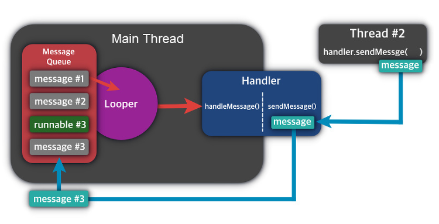

# Thread
- 프로세스(Process) 는 '실행중인 프로그램' 을 의미합니다. 프로그램을 실행하면 OS 로 부터 실행에 필요한 자원(메모리) 를 할당 받아 프로세스가 됩니다.
- 프로세스는 프로그램을 수행하느 데 필요한 데이터와 메모리 등의 자원 그리고 쓰레드로 구성되어 있으며, 프로세스 자원을 이용해 실제로 **작업을 수행**하는 것을 **쓰레드**라고 부릅니다.
- 그렇기 때문에 모든 프로세스에는 반드시 **하나 이상**의 쓰레드가 존재합니다.

### 안드로이드 시스템에서의 Thread
- 애플리케이션이 구동되면 안드로이드 시스템은 애플리케이션을 위한 실행 Thread  를 생성합니다.
- 이 Thread 는 **Main Thread** 또는 **UI Thread** 라고 불리기도 합니다.
- Main Thread 는 사용자 인터페이스 위젯에 이벤트를 전달하거나 화면을 그리는 작업을 담당합니다.
- 동일한 Process 안에서 실행되는 모든 컴포넌트는 Main Thread  에서 실행되면 컴포넌트의 시스템 호출 역시 Main Thread 에서 실행됩니다.
- 안드로이드 UI 는 기본적으로 싱글 Thread 모델로 동작합니다.
- 안드로이드 어플리케이션을 실행하면 시스템은 AndroidManifest.xml 파일에 등록되어 있는 최초의 액티비티를 메모리로 올려 프로세스를 만들며, 이때 Main Thread 가 자동으로 생성됩니다.

### 안드로이드 시스템에서 Multi Thread 가 필요한 이유
- 액티비티 ANR(Application Not Responding) 을 해결하기 위한 좋은 방법 중 하나입니다.
- 액티비티 ANR : 액티비티가 화면에 출력된 상황에서 사용자 이벤트에 5초 이내에 반응하지 못하면 시스템에서 액티비티를 강제로 종료하는 상황
- 액티비티에서 5초 이상 업무처리를 하느라 사용자 이벤트를 처리하지 못하는건 대부분 액티비티의 수행흐름이 하나이기 때문입니다.
- 이러한 문제는 스레드로 해결할 수 있으며, 액티비티 내에서 스레드를 이용해 수행 흐름을 여러 개로 만들어서 하나의 수행 흐름이 시간이 오래 걸리는 작업을 하고 있더라도, 다른 수행 흐름이 사용자 이벤트를 처리하게 만들어주면 됩니다.

### Thread 를 구현하는 방법
- Thread 를 구현하는 방법에는 Thread Class 를 상속받는 방법과 Runnable 인터페이스를 구현하는 방법이 있습니다.
- 하지만 Thread Class 를 상속받으면 다른 Class 를 상속받을 수 없기 때문에, Runnable 인터페이스를 구현하는 방법이 일반적입니다.
- Runnable 인터페이스를 구현하는 방법은 재사용성이 높고, 코드의 일관성을 유지할 수 있어서 객체지향적인 방법이라고 할 수 있습니다.
- Runnable 인터페이스를 구현한 경우, Runnable 인터페이스를 구현한 클래스의 인스턴스를 생성한 다음, 이 인스턴스를 Thread 클래스의 생성자의 매개변수로 제공해야 합니다.
```
private val runnable = Runnable{}
private val thread = Thread(runnable)
private fun makeThread(){
	Thread.isDeaemon = true // 메인 쓰레드 종료시 같이 종료
	Thread.start()
}
```
- 쓰레드를 생성한 뒤엔 start() 를 호출하여 쓰레드를 실행하며, 하나의 쓰레드에 대해 start() 는 한번만 호출될 수 있습니다.
- 한번 실행이 종료된 쓰레드는 다시 실행할 수 없으며, 실행중인 사용자 쓰레드가 하나도 없을 때 프로그램이 종료됩니다.

### Thread 사용 시 주의할 점
- Thread 에서 직접적으로 UI 를 변경하면 안됩니다.
- 동기화 문제 때문에 안드로이드 시스템에서는 Main Thread 에서만 UI 작업이 가능하도록 제한했습니다.
> **동기화 문제:** 병렬 처리로 돌아가고 있는 Main 과 Sub Thread 에서 같은 view 를 변경하도록 명령 했을 때 어떤 Thread 를 따라야 할지 모르는 문제
- 이 문제를 해결하기 위해서 다른 쓰레드 (Sub Thread) 에서 메인 쓰레드 (Main Thread, UI Thread) 에 접근하는 다양한 방법을 제공하고 있습니다.

1. Handler : 일반적인  Thread 간 상호 작용을 위한 클래스로 work Thread 가 여러개이고, 서로 비슷한 메세지를 보내야 한다면 핸들러 클래스를 정의해서 사용하는 편이 좋습니다.
2. view.post(Runnable()) : UI Thread 의 메세지큐에 작업을 추가하여, 해당 view  객체에 접근 가능한 경우에 사용합니다.
3. view.postDelayed(Runnable()) : 일정 시간 후에 작업 처리
4. Activity.runOnUIThread(Runnable()) : 핸들러 없이 UI Thread 의 메세지 큐에 작업을 전달(post). Runnable 객체를 넘겨받는데, 그 코드를 무조건 UI 쓰레드 에서 실행
5. AsyncTask : API Level 30 에서 deprecated 되었으며 Coroutine 으로 대체하여 사용하도록 공식문서에서 권고하고 있습니다.


# Handler
- 안드로이드에서는 Main Thread  를 통해서만 화면 UI 를 변경할 수 있기 때문에, 핸들러를 통해서 Main Thread 에 접근하여 UI 를 수정해야 합니다.
- Handler 를 생성하는 Thread 만이 다른 Thread 가 전송하는 Message 와 Runnable 객체를 받을 수 있습니다.
- Handler 가 처리하는 대상은 메세지(Message) 와 Runnable 객체이며 단일 Thread 에 단 하나의 Looper 와 Message Queue 가 존재하지만 Handler 는 다수 존재 가능합니다.
- Handler 객체를 새로 생성하면 해당 Thread 의 Message Queue 에 바인드(bind) 됩니다.
- 자료구조에서 메세지를 쌓아두는 공간을 Message Queue 라고 합니다.
- Looper 는 Message Queue 가 비어있는 동안은 아무 행동도 하지 않다가, Message Queue 에 메세지가 들어오면 해당 메세지를 꺼내 적절한 Handler 로 전달하는 역할을 합니다.
- Thread 간의 통신을 위해 메세지가 필요하다면 Handler 의 obtainMessage() 메서드를 사용할 수 있습니다.
- Runnable 인터페이스는 run() 추상 메서드를 가지고 있으므로, 상속받은 클래스는 run() 코드를 반드시 구현해야 합니다.



안드로이드에서는 상대적으로 간단하게 핸들러를 구현할 수 있는데
```
private fun makeHandler(){
	Handler(Looper.getMainLooper()){
		// 메세지 작성
	}
}
```
이런식으로 Handler 를 생성하여 사용할 수 있습니다. 또한
```
private fun makeDelayHandler()({
	Handler(Looper.getMainLooper()).postDelayed({
		// 메세지 작성
	}, duration)
}
```
으로 postDelayed 메서드를 사용해 duration 만큼의 시간이 지난 뒤에 실행되도록 미리 정해둘 수도 있습니다. 

## References 참고문헌
- https://developer.android.com/guide/components/processes-and-threads
- https://developer.android.com/reference/android/os/Handler
- https://developer.android.com/reference/android/os/Looper
- https://link2me.tistory.com/1233
- https://itmining.tistory.com/5

