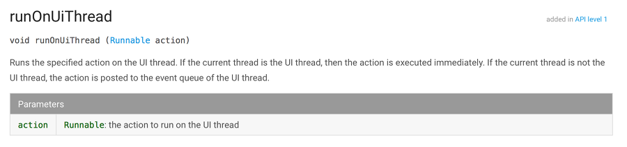
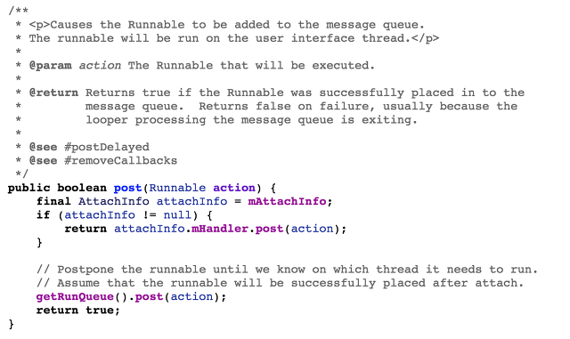

# 스레드와 핸들러

생성일시: January 2, 2022 1:29 PM
채널: Note, study
카테고리: android

1. 안드로이드는 사용자가 어떤 이벤트를 발생시켰을때 어플리케이션이 5초이내 응답하지 않으면 이것을 **ANR(Application Not Responding)로 판단**하여 앱을 강제 종료 시킨다. 따라서 특정 업무처리 로직이 5초 이상 진행되어 사용자 이벤트를 처리하지 못하게 앱을 구현할 경우 경우에 따라 엄청난 크래시를 만들수있다!
2. ANR을 피하기 위해서는 사용자 이벤트에 반응하는 이벤트 처리와 오래걸리는 업무 처리를 병렬로 처리할 수 있도록 앱을 구현해야한다. 즉 **사용자 이벤트에 반응하는 mainThread와 별도로 특정업무를 처리하는 업무 처리용 Thread**를 만들어야 한다.
    
    ```kotlin
    // 스레드 구현 첫번째 방법 Thread를 상속
    class MyThread : Thread() {
        override fun run() {
            println("run MyThread")
        }
    }
    
    fun main() {
        val thread = MyThread()
        thread.start()
    }
    ```
    
    ```kotlin
    // 스레드 구현 첫번째 방법 Runnable 인터페이스를 구현
    fun main() {
        val thread = Thread(object: Runnable {
            override fun run() {
                println("run Runnable")
            }
        })
        thread.start()
    }
    ```
    
    스레드를 제어하기 위해 sleep(), wait(), notify() 함수 등을 사용할 수 있다.
    
3. 이렇게 처리해도 문제는있다. **개발자가 만든 Thread에서 액티비티 화면의 뷰 요소에 접근하면 런타임 에러(CalledFromWrongThreadException)가 발생**한다. 이는 하나의 view에 여러스레드에서 동시에 접근해서 발생하는 동기화 이슈를 구조적으로 방지하기 위해 채택한 방식이다. 그렇다면 이러한 에러를 피하기 위해서는 어떻게 해야할까?
4. MainThread외에 다른 스레드에서는 직접 view에 접근하는 것 대신에 MainThread의 Handler를 통해 View의 처리를 의뢰해야합니다. 여기서 핸들러는 메시지를 전달하는 역할을 한다.
    
    ```kotlin
    private val handler = Handler(Looper.getMainLooper())
    private val contentsEditText: EditText by lazy { findViewById<EditText>(R.id.contentsEditText) }
    
    override fun onCreate(savedInstanceState: Bundle?) {
    	super.onCreate(savedInstanceState)
    	setContentView(R.layout.activity_main)
    	
    	val contentsPreference = getSharedPreferences("contents", MODE_PRIVATE)
    	contentsEditText.setText(contentsPreference.getString("contents", ""))
    
    	val runnable = Runnable {
    		contentsPreference.edit(true) {
    			putString("contents", contentsEditText.text.toString())
    		}
    	}
    
    	contentsEditText.addTextChangedListener {
    		Log.d("MainActivity", "text changed ${it}")
    		**handler.removeCallbacks(runnable)
    		handler.postDelayed(runnable, 500)**
    	}
    }
    
    // 출처 : https://binendbinend.tistory.com/8
    ```
    
    post나 sendMessage 함수 등으로 메세지를 전달하며 sendMessage()의 경우 Message 객체가 매개변수로 사용되고 handleMessage함수를 오버라이드해 메세지를 처리할 수 있다. 스레드와 핸들러를 대신하여 AsyncTask 클래스를 사용하여 위의 문제를 해결할 수도 있다.
    
5.  전달된 message나 runnable을 차례로 꺼내서 핸들러로 전달하는 역할은 Looper가 수행한다. Looper는 메시지 큐를 감지하는 observer역할을 한다.
    
    스레드가 핸들러의 sendMessage()함수를 호출한다. 핸들러는 전달받은 메시지를 메시지 큐에 담는다. Looper는 메시지가 큐에 담기는 것을 감지하고 메시지를 추출해 핸들러의 handleMessage함수를 호출합니다.
    

## runOnUiThread 와 View.post

1. 특정 동작을 UI 스레드에서 동작하도록 합니다. 만약 현재 스레드가 UI 스레드이면 그 동작은 즉시 수행됩니다. 현재 스레드가 UI 스레드가 아니면, 필요한 동작을 UI 스레드의 이벤트 큐로 전달합니다.
    
    
    
2. Runnable 작업은 메세지큐에 추가될 것입니다. 그 작업은 UI thread에서 수행될 것입니다.
    
    
