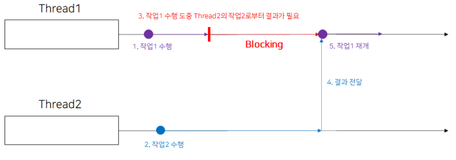
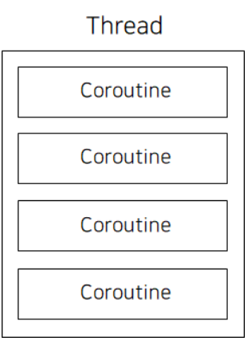
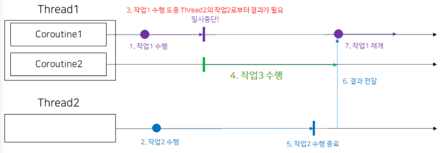
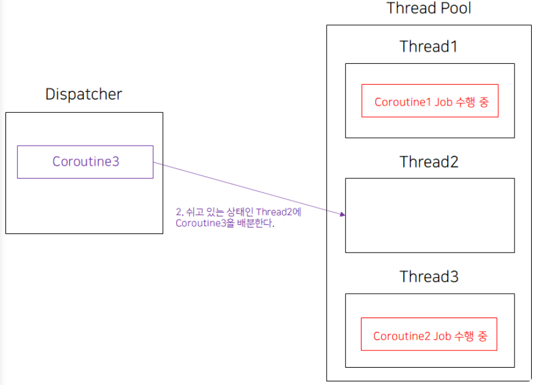
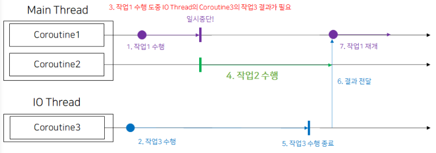

### 공식문서 예시 해석

```kotlin
class LoginRepository(...) {
    ...
    **suspend** fun makeLoginRequest(
        jsonBody: String
    ): Result<LoginResponse> {

        // Move the execution of the coroutine to the I/O dispatcher
        return **withContext(Dispatchers.IO)** {
            // Blocking network request code
        }
    }
}
```

```kotlin
class LoginViewModel(
    private val loginRepository: LoginRepository
): ViewModel() {

    fun login(username: String, token: String) {

        // Create a new coroutine on the UI thread
        viewModelScope.launch {
            val jsonBody = "{ username: \"$username\", token: \"$token\"}"

            // Make the network call and suspend execution until it finishes
            val result = loginRepository.**makeLoginRequest**(jsonBody)

            // Display result of the network request to the user
            when (result) {
                is Result.Success<LoginResponse> -> // Happy path
                else -> // Show error in UI
            }
        }
    }
}
```

- LoginViewModel의 `login()` 함수에 코루틴을 만듭니다. `makeLoginRequest()`는 IO Thread에서 코루틴을 실행하고, `login()` 함수의 코루틴은 Main Thread에서 실행됩니다.
- `makeLoginRequest`가 `suspend` 함수이므로 코루틴 내부에서 실행되어야 합니다.
- 기본 스레드의 `View` 레이어에서 `login()` 함수를 호출합니다.
- `login()` 함수의 `launch` 블록에서 기본 스레드에서 네트워크 요청을 보낼 새 코루틴을 만들고,  IO Thread에서 새 코루틴을 실행합니다.
- 코루틴 내에서 `loginRepository.makeLoginRequest()` 호출은 `**makeLoginRequest()`의 `withContext` 블록 실행이 끝날 때까지 이후 코루틴의 실행을 *일시정지* 합니다.**
- `withContext` 블록이 완료되면 `login()`의 코루틴이 네트워크 요청의 결과와 함께 ***기본 스레드*에서 실행을 재개**합니다.

## Coroutine이란?

- 비동기 작업에서 Thread는 생성과 작업을 전환하는 비용이 비싸다. 또한 한 Thread가 다른 Thread부터의 작업을 기다려야 할 때 Blocking 하게 되면 해당 Thread는 하는 작업 없이 다른 작업이 끝마쳐질때까지 기다려야 하기 때문에 자원이 낭비된다. ⇒ Thread의 문제점
    
    
    
    Thread의 문제점 : Thread Blocking
    
- 코루틴 역시 Thread라는 작업의 단위를 사용하지만, Thread 내부에서 작은 Thread처럼 동작하는 코루틴이 존재한다. Thread 하나를 일시 중단 가능한 다중경량 Thread 처럼 활용하는 것이 Coroutine이다.



### Coroutine을 경량 Thread 처럼 활용하기?



Coroutine을 경량 Thread 처럼 활용해 Thread를 Non Blocking 하게 만들기

- Thread1에서 Coroutine 2개를 생성해 Thread1의 Coroutine1에서는 작업 1을 수행하게 만들고 Thread2에서는 작업2를 수행하게 만든다.
- Thread1의 Coroutine1에서 작업 1수행 도중 Thread2로부터 결과가 필요해진다. 하지만 Thread2의 작업2가 끝나지 않아 작업 1을 마저할 수 없다.
- 이때 Coroutine1은 Thread1을 Blocking 하는 대신 자신의 작업을 일시중단하고 Coroutine2에 Thread1 리소스 사용 권한을 넘겨준다. 이제 Thread1의 Coroutine2가 작업 3을 위해 Thread1을 사용한다.
- 이후 Thread2의 작업이 종료되고, 작업 3을 수행하던 Coroutine2가 자신의 작업을 마무리 하고 Coroutine2 자신을 일시중단 시킨다.
- 이제 다시 Thread1의 제어권한이 Coroutine1로 돌아와 Thread1은 Coroutine1이 마저 작업을 수행할 수 있도록 Thread2로부터 결과를 전달받아 작업1을 재개한다.
- ⇒ Coroutine1의 작업1이 일시중단 되는 순간 Coroutine2에게 Thread1의 제어 권한을 넘겨, Blocking 되는 상황이 줄어 Thread1의 Thread 리소스를 최대한 활용할 수 있게 되었다.
- ⇒ 또한 Thread는 생성 비용이 큰데, Coroutine은 Thread를 만드는 대신 하나의 Thread 상에서 자신을 일시중지할 수 있도록 하여 Thread 생성 비용을 줄인다.

> Coroutine은 Thread 안에서 실행되는 **일시중단 가능한 작업의 단위**이다. 하나의 스레드에 여러 코루틴이 존재할 수 있다.
> 
> - 다만, 하나의 스레드 안에서 여러 코루틴을 동시에 실행하는 것은 불가능하다. 그 이유는 코루틴은 중단지점(suspension point)에 도달하자마자 해당 스레드를 떠나 그 스레드 내의 대기중인 다른 코루틴을 선택할 수 있도록 해방하기 때문이다.

## Dispatcher란?

- (Dispatch : v. 보내다) Dispatcher는 스레드에 코루틴을 보내는 역할을 한다. 코루틴을 Dispatcher에 전송하면 Dispatcher는 자신이 관리하는 스레드풀 내의 스레드 부하 상황에 맞게 코루틴을 분배한다.
- Dispatcher는 자신이 잡고 있는 스레드풀에서 자원이 남는 스레드가 어떤 스레드인지 확인한 후, 해당 스레드에 코루틴을 전송한다.
    
    
    
- 코루틴은 스레드풀을 직접 제어하지 않고 Dispatcher를 통해 제어한다. 그래서 Dispatcher에 코루틴을 보내면 Dispatcher는 스레드에 코루틴을 분산시킨다.
- 안드로이드에는 이미 Dispatcher가 생성되어 있어 이를 활용하면 된다.
    - Dispatcher.Main : 메인 스레드에서 코루틴을 실행하는 디스패처. UI와 상호작용 하는 작업을 실행하기 위해서만 사용해야 한다.
    - Dispatcher.IO : 디스크 또는 네트워크 I/O 작업을 실행하는데 최적화 되어 있는 디스패처
    - Dispatcher.Default : CPU를 많이 사용하는 작업을 기본 스레드 외부에서 실행하도록 최적화 되어있는 디스패처. 정렬 작업이나 JSON 파싱 작업 등에 최적화 되어있다.
    
    ```kotlin
    CoroutineScope(Dispatcher.Main).launch {
    	updateButton() // 필요한 Job 수행. Main이므로 UI 작업
    }
    ```
    

### Dispatcher, `launch{ }`, `async{ }`(+`await()`) 그리고 Coroutine

- 스레드에 코루틴을 보내기 위해 Dispatcher에 Coroutine을 붙이는 방법은 launch{ }, async{ } 두가지 메소드를 통해 가능하다.
    - launch{ } : **결과를 반환하지 않고**, 작업 Job이 반환된다.
        
        ```kotlin
        with(CoroutineScope(Dispatchers.Main)){
        	val job : Job = launch{ println(1) }
        }
        ```
        
    - async{ } : **결과를 반환**하며, 결과값은 Deffered<>로 감싸서 반환된다.
        - Deffered<>는 미래에 올 수 있는 값을 담아놓은 객체이다. ⇒ 실행 결과 값을 담아둔다.
        
        ```kotlin
        CoroutineScope(Dispatchers.Main).launch{
        	val defferedInt : Deffered<Int> = async{
        		println(1)
        		1 // 마지막 줄 반환
        	}
        
        	val value = defferedInt.await()
        	println(value) // 1 출력
        }
        ```
        
        - **await()** 메소드는 async()로 시작한 코루틴의 결과가 반환되기 까지 기다린다. 이를 **코루틴이 일시중단** 되었다고 한다.
        - 이러한 특성 때문에 await() 메소드는 일시중단이 가능한 **코루틴 내부**에서 사용하거나, **suspend fun** 에서만 사용 가능하다.
        - await()으로 async 블록의 결과 반환을 기다렸다가, 이후 결과가 반환되었을 때 코루틴은 다시 재개된다.

### Dispatchers Switching

- 파일 시스템으로부터 Array<Int>를 받아와서, 정렬한 다음, 텍스트뷰에 출력하는 과정을 한다고 해보자. ⇒ 파일 입출력(Dispatchers.IO), Array 정렬(Dispatchers.Default), 텍스트뷰 출력(Dispatchers.Main)과 같이 여러 Dispatchers에 맞는 작업이 들어가므로 이를 위해 Dispatchers Switching이 필요하다.

```kotlin
CoroutineScope(Dispatchers.Main).launch{
	// 1. 데이터 입출력 : Dispatchers.IO
	val defferedInt = **async**(Dispatchers.IO){
		println("1. 데이터 입출력")
		arrayOf(3, 1, 2, 4, 5)
	}

	// 2. 정렬 작업 => CPU 많이 사용 : Dispatchers.Default
	val sortedDeffered = **async**(Dispatchers.Default) {
		val value = deferedInt.**await**()
		value.sortedBy{ it }
	}

	// 3. TextView에 세팅 => UI 작업 : Dispatchers.Main
	**launch** {
		val sortedArray = sortedDeffered.**await**()
		setTextView(sortedArray)
	}
}
```

> 코루틴을 생성할 때 Dispatcher를 설정하는 것으로 Dispatcher 전환이 가능하다. (따로 인자로 넘겨주지 않으면 Dispatchers.Main에서 실행)
> 

> 결과 값 반환이 필요하면 async, 결과값 반환이 필요없으면 launch로 Coroutine 실행
> 
> - async로 반환된 결과 값을 받아 처리하려면 await()으로 결과 값 반환을 기다린다.
> - 다만, **await()**은 코루틴을 일시중단시키므로 **코루틴 내부에서 실행**하거나 **suspend 함수에서 실행**한다.
>     - suspend 함수는 일시중단 가능 함수이기 때문에, 이 함수 역시 무조건 코루틴 내부에서 실행되어야 한다.

### 일시중단 가능한 코루틴



```kotlin
fun exampleSuspend(){
	val job3 = CoroutineScope(Dispatchers.IO).async{
		// 2. IO에서 job3 실행
		(1..10000).sortedByDescending{ it }
	}

	val job1 = CoroutineScope(Dispatchers.Main).launch{
		println("job1 수행") // 1. job1 실행
		// 3. job1의 남은 작업을 위해 job3의 결과값을 기다리면서 job1 일시중단
		val job3Result = job3.await()
		// 5. job3의 결과 전달받음
		// 6. job3의 결과값으로 나머지 job1 작업 재개
		println("job1 작업 재개")
		job3Result.forEach{
			println(it)
		}
	}

	val job2 = CoroutineScope(Dispatchers.Main).launch{
		// 4. MainThread를 점유하고 있던 job1이 일시중단 되면서
		// 같은 메인스레드의 코루틴 작업인 job2 실행 및 완료
		println("job2 수행 완료")
	}

}
```

```
job1 수행
job2 수행 완료
job1 작업 재개
10000
9999
9998
9997
9996
..
```

참조

- [https://kotlinworld.com/139?category=973476](https://kotlinworld.com/139?category=973476)
- https://kotlinworld.com/141?category=973476
- https://kotlinworld.com/142?category=973476
- https://kotlinworld.com/144?category=973476