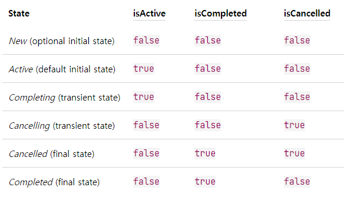

# Coroutine
- 비동기적으로 실행되는 코드를 간소화하기 위해 Android에서 사용할 수 있는 동시 실행 설계 패턴
- 코루틴이 시작된 스레드를 중단하지 않으면서 비동기적으로 실행되는 코드이며, 기존의 복잡한 AsyncTask 또는 다수 스레드 관리를 직접 해주지 않아도 되어 기존 다중 스레드보다 훨씬 더 효율적으로 동작

# CoroutineScope
- 코루틴의 범위, 코루틴 블록을 묶음으로 제어할 수 있는 단위
- 모든 코루틴은 스코프 내에서 실행되어야 하는데 이를 통해서 액티비티 또는 프래그먼트의 생명주기에 따라 소명 될 때 관련 코루틴을 한번에 취소할 수 있고, 이는 곧 메모리 누수를 방지
- CoroutineContext 타입 필드를 launch 등의 확장 함수 내부에서 사용하기 위한 매게체 역할
- 모든 코루틴은 항상 자신이 속한 스코프를 참조해야하며 이후에 cancel로 모두 취소 가능

## CoroutineScope의 종류
- **CoroutineScope** : 버튼을 눌러 다운로드 하거나 서버에서 이미지를 열 때 등, 필요할 때만 열고 완료되면 닫아주는 코루틴스코프를 사용할 수 있다. 또한 GlobalScope와 달리 Dispatcher를 지정하여 코루틴이 실행될 스레드를 지정할 수 있다.
- **GlobalScope** : 앱의 생명주기와 함께 동작하기 때문에 실행 도중에 별도 생명 주기 관리가 필요없고, 시작~종료 까지 긴기간 실행되는 코루틴의 경우에 적합
- **ViewModelScope** : Jetpack 아키텍처의 뷰모델 컴포넌트 사용시 ViewModel 인스턴스에서 사용하기 위해 제공되는 스코프이며 해당 스코프로 실행되는 코루틴은 뷰모델 인스턴스가 소멸될 때 자동으로 취소된다.

# CoroutineContext
- 실제로 코루틴이 실행중인 여러 작업(Job)과 Dispatcher를 저장하는 일종의 맵
- 이를 통해 코틀린 런타임은 다음에 실행할 작업을 고르고 어떤 스레드에 배정할 지 결정
- 주요 요소로는 Job과 Dispatcher가 있다.

# Dispatcher
> 디스패처는 코루틴을 적당한 스레드에 할당하며, 코루틴 실행 도중 일시 정지 또는 실행 재개를 담당
- **Dispatchers.Default** : 안드로이드 기본 스레드풀 사용. CPU를 많이 쓰는 작업에 최적화 (데이터 정렬, 복잡한 연산 등)
- **Dispatchers.IO** : 이미지 다운로드, 파일 입출력 등 입출력에 최적화 되어있는 디스패쳐 (네트워크, 디스크, DB 작업에 적합)
- **Dispatchers.Main** : 안드로이드 기본 스레드에서 코루틴 실행. UI 와 상호작용에 최적화
- **Dispatchers.Unconfined** : 호출한 컨텍스트를 기본으로 사용하는데 중단 후 다시 실행될 때 컨텍스트가 바뀌면 바뀐 컨텍스트를 따라가는 디스패쳐
- [Dispatcher 공식문서 확인하기](https://kotlin.github.io/kotlinx.coroutines/kotlinx-coroutines-core/kotlinx.coroutines/-dispatchers/index.html)

# Job
- 코루틴의 상태를 가지고 있으며, 아래와 같은 6가지 상태를 포함하고 active/completed/canceled 상태에 따라 값이 아래의 표와 같다.

- 이러한 Job을 바탕으로 코루틴의 상태를 확인할 수 있고, 제어할 수 있다.


### 사용할 수 있는 함수
- **start** : 현재의 코루틴의 동작 상태를 체크하며, 동작 중인 경우 true, 준비 또는 완료 상태이면 false를 return 한다.
- **join** : 현재의 코루틴 동작이 끝날 때까지 대기한다. async {} await 처럼 사용할 수 있다.
- **cancel** : 현재 코루틴을 즉시 종료하도록 유도만 하고 대기하지 않는다. 다만 타이트하게 동작하는 단순 루프에서는 delay 가 없다면 종료하지 못한다.
- **cancelAndJoin** : 현재 코루틴에 종료하라는 신호를 보내고, 정상 종료할 때까지 대기한다.
- **cancelChildren** : CoroutineScope 내에 작성한 childeren coroutine들을 종료한다. cancel과 다르게 하위 아이템들만 종료하며, 부모는 취소하지 않는다.
- [Job 공식문서 확인하기](https://kotlin.github.io/kotlinx.coroutines/kotlinx-coroutines-core/kotlinx.coroutines/-job/)

# Coroutine Builder
- 코틀린은 코루틴 빌더에 원하는 동작을 람다로 넘겨 코루틴을 생성하여 실행하는 방식을 사용
- **launch** : 현재 스레드 중단 없이 코루틴을 즉시 시작 시킨다. 결과를 호출한 쪽에 반환하지 않는다. suspend 함수가 아닌 일반 함수에서 suspend 함수를 호출할 때나 코루틴의 결과 처리가 필요 없을 때 사용
- **async** : 현재 스레드 중단 없이 코루틴을 시작 시킨다. 호출 쪽에서 await() 을 통해 코루틴 결과를 기다릴 수 있다. 병행으로 실행될 필요가 있는 다수의 코루틴을 사용할 때 사용. async 빌더는 suspend 함수 내부에서만 사용 가능
- **withContext** : 부모 코루틴에 의해 사용되던 컨텍스트와 다른 컨텍스트에서 코루틴을 실행시킬 수 있다. 코루틴에서 결과를 반환할 대 async 대신 유용하게 쓸 수 있다.
- **coroutineScope** : 병행으로 실행될 다수의 코루틴을 suspend 함수가 시작시키고 모든 코루틴이 완료될 때만 어떤 처리가 필요할 때 이상적이다. 만약 이런 코루틴이 coroutineScope 빌더로 실행되면 호출 함수는 모든 자식 코루틴이 완료되어야 실행이 끝나고 복귀된다. 여러 코루틴 중 하나라도 실행에 실패하면 모든 다른 코루틴이 취소된다.
- **supervisorScope** : coroutineScope 빌더와 비슷하다. 그러나 한 코루틴이 실패해도 다른 코루틴이 취소되지 않는다는 차이점이 있다.
- **runBlocking** : 코루틴을 시작시키고 완료될 때 까지 현재 스레드를 중단시킨다. 코루틴의 취지와 정반대다 . 그러나 코드 테스트, 레거시 코드 및 라이브러리 통합시 유용하다. 그외 경우엔 되도록 사용하지 않아야 한다. CoroutineScope의 확장 함수가 아니어서 코루틴 스코프 없이도 실행 가능하다.

## launch 와 async
- 코루틴은 launch와 async로 시작이 가능하다. launch는 상태를 관리 할 수 있고 async는 상태를 관리하며 결과까지 반환 받을 수 있다.
- 코루틴 내부에 여러 launch 블록이 있는 경우 모두 새로운 코루틴으로 분기되어 동시 실행 되기 때문에 순서를 정할 수 없다. 순서를 정해야한다면 join() 을 사용해서 순처적으로 실행되도록 코드를 짤 수 있다.
- async로 코루틴 스코프의 결과를 받아서 쓸 수 있다. 특히 연산시간이 오래걸리는 2개의 네트워크 작업의 경우를 예로들면 2개의 작업이 모두 완료되고 나서 이를 처리하려면 await() 을 사용할 수 있다. 이때는 async 작업이 모두 완료되고 나서야 await() 이 실행된다.

## suspend
- suspend 함수가 코루틴 안에서 사용되면 suspend 함수가 호출되기 이전까지의 코드의 실행이 멈추며 suspend 함수가 처리가 완료된 후 멈춰 있던 원래 스코프의 다음 코드가 실행된다.
```

	suspend fun doSomething(){
		for(i in 0..10) {
			Log.d("doSomething", i.toString())
		}
	}

	CoroutineScope(Dispathcers.Main).lauch {
		// 선 처리 코드
		doSomething()
		// 후 처리 코드
	}

```
- suspend 키워드를 붙인 함수가 실행되면서 호출한 쪽의 코드를 잠시 멈추게 되지만 스레드의 중단이 없다.

## withContext 디스패쳐 분리 사용
- suspend 함수를 코루틴 스코프에서 사용할 때 호출한 스코프와 다른 디스패쳐를 사용할 때가 있는데, 호출쪽 코루틴은 Main 디스페쳐로 UI를 제어, suspend 함수는 파일 IO를 하는 경우 withContext 를 사용하여 suspend 함수의 디스패쳐를 IO로 변경해서 사용할 수 있다.
- 기본적으로 부모의 코루틴 디스패쳐를 사용하지만 withContext로 디스패쳐를 달리 사용할 수 있게 된다.
```

	CoroutineScope(Dispathcers.Main).lauch {
		// UI 처리 코드
		val result = withContext(Dispathcers.IO){
			readFile()
		}
		Log.d("테스트", result.toString())
	}

```

## 참고 사이트
- https://whyprogrammer.tistory.com/596
- https://developer.android.com/kotlin/coroutines?hl=ko
- https://medium.com/@limgyumin/%EC%BD%94%ED%8B%80%EB%A6%B0-%EC%BD%94%EB%A3%A8%ED%8B%B4%EC%9D%98-%EA%B8%B0%EC%B4%88-cac60d4d621b
- https://thdev.tech/kotlin/2019/04/08/Init-Coroutines-Job/
