# Coroutine 개념정리
========================================================

# 코루틴의 특징
  - 코루틴은 스레드 위에서 실행되는데 코루틴1,2,3 이 있다고 가정 할 때코루틴1 을 실행하던 중 2가 실행되어도 실행중인 스레드를 정지하면서 컨텍스트 스위칭 개념으로 다른 스레드로 전환하는 것이 아니라,
    기존 스레드를 유지하며 기존 스레드에서 코루틴2를 실행하게 된다. 즉 스레드의 멈춤없이 루틴을 돌리게 되어 컨텍스트 스위칭 비용이 감소된다.
    
# 코루틴 스코프
  - GlobalScope : 앱의 생명주기와 함께 동작. 실행 도중에 별도 생명 주기 관리가 필요없음. 시작~종료 까지 긴기간 실행되는 코루틴의 경우에 적합.
  - CoroutineScope : 버튼을 눌러 다운로드 하거나 서버에서 이미지를 열 때 등. 필요할 때만 열고 완료되면 닫아주는 코루틴스코프를 사용할 수 있다.
  - ViewModelScope : 뷰모델 컴포넌트 사용시 ViewModel 인스턴스에서 사용하기 위해 제공되는 스코프. 해당 스코프로 실행되는 코루틴은 뷰모델 인스턴스가 소멸될 때 자동으로 취소된다.
  
# 코루틴 디스패처
  - 코루틴을 적당한 스레드에 할당하며, 코루틴 실행 도중 일시 정지 or 실행 재개를 담당한다
    코루틴을 만든 다음 해당 코루틴을 Dispatcher에 전송하면 Dispatcher은 자신이 관리하는 스레드풀 내의 스레드의 부하 상황에 맞춰 코루틴을 배분한다
    디스패쳐를 설정하지 않으면 기본 디스패쳐인  Main Dispatcher에 보내진다.
    
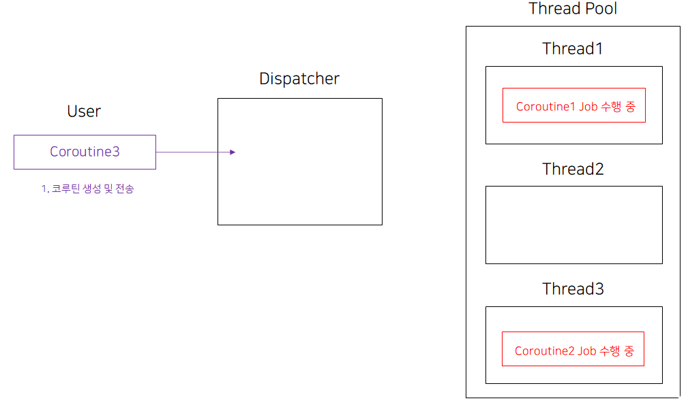
    Dispatcher은 자신이 잡고 있는 Thread Pool에서 자원이 남는 스레드가 어떤 스레드인지 확인한 후, 해당 스레드에 코루틴을 전송
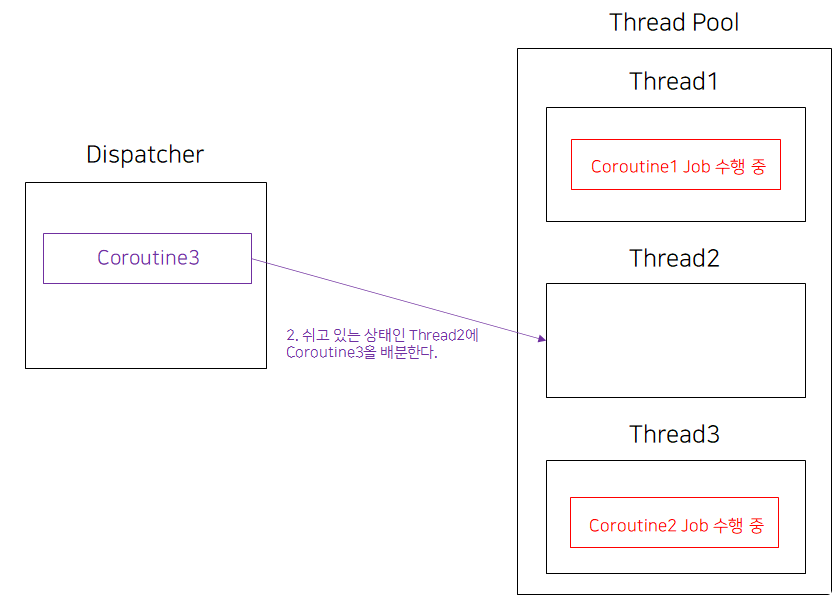
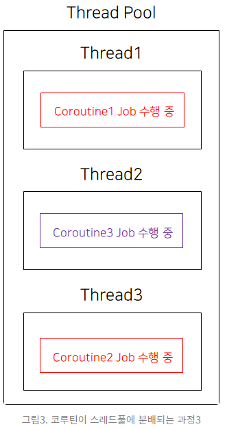

  - Dispatchers.Default : 안드로이드 기본 스레드풀 사용. CPU를 많이 쓰는 작업에 최적화. (데이터 정렬, 복잡한 연산 등)
  - Dispatchers.IO : 이미지 다운로드, 파일 입출력 등 입출력에 최적화 되어있는 디스패쳐 (네트워크, 디스크, DB 작업에 적합)
  - Dispatchers.Main : 안드로이드 기본 스레드 에서 코루틴 실행. UI 와 상호작용에 최적화.
                        쓰레드 풀에 쓰레드가 1개인듯 하다. Dispatchers.Main으로 여러번 Dispatchers.Main으로 실행 시키면 순차적으로 실행된다.
                        당연히 하나여야 할것이 UI를 갱신해야 하는 입장에서 쓰레드가 하나여야 할 것이다.
                         
                         ````````
                         val job1 = CoroutineScope(Dispatchers.Main).launch{
                                     for(i in 1..1000){
                                         Log.i("aaaa", "job1 $i")
                                     }
                                 }
                         
                         val job2 = CoroutineScope(Dispatchers.Main).launch{
                                     for(i in 1..1000){
                                         Log.i("aaaa", "job2 $i")
                                     }
                                 }
                                 
                         결과 :
                         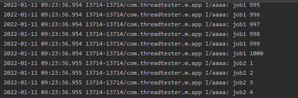
                         
                         Dispatchers.IO나 Dispatchers.Default로 실행 결과
                         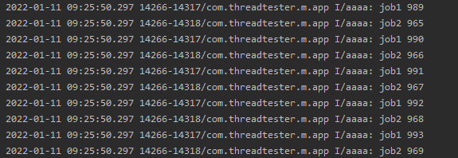
                         ````````
  - Dispatchers.Unconfined : 호출한 컨텍스트를 기본으로 사용하는데 중단 후 다시 실행될 때 컨텍스트가 바뀌면 바뀐 컨텍스트를 따라가는 특이한 디스패쳐???
  
# 코루틴 상태관리
  - 코루틴은 launch와 async로 시작이 가능하다. 코루틴을 생성하고 상태 관리 매서드를 호출해서 중단, 지연 할 수 있다.
  - launch : 단순히 상태 관리만 가능. launch 생성한 자식 Job은 예외 발생시 부모 Job 을 취소시킨다.
  - async로 : 상태관리 + 결과반환. async 생성한 자식 Job은 예외가 발생해도 부모 Job이 취소되지 않는데 이는 반환 결과에 예외도 포함시켜버리기 때문이다.
  
    Dispatcher에 Coroutine을 붙이는 작업은 launch{ }와 aync{ } 두가지 메서드를 통해 가능하다.
    만일 부모 디스패쳐와 다른 디스패쳐로 전환 할려면 async(Dispatchers.IO)와 같이 하면 해당 디스패쳐로 스위칭 된다.
    
    ````````
    CoroutineScope(Dispatchers.Main).launch {
                val deferredInt : Deferred<Int> = async(Dispatchers.IO) {
                    Log.i("aaaa", "xxxxxxx")
    
                    delay(1000)
                    1
                }
    
                val value = deferredInt.await()
                mBinding.timer.text = value.toString()
                Log.i("aaaa", "${value}")
            }
    ````````
  
  - await : 코루틴 결과가 반환되기까지 기다린다.
  - cancel : 코루틴의 동작을 멈추는 상태관리 매서드. 하나의 스코프 안에 여러 코루틴의 존재하는 경우 하위 코루틴 또한 모두 멈춘다.
  - delay : 다른 코루틴에 실행을 양보.
  - join : 코루틴 내부에 여러 launch 블록이 있는 경우 모두 새로운 코루틴으로 분기되어 동시 실행 되기 때문에 순서를 정할 수 없다.
           순서를 정해야한다면 join() 을 사용해서 순차적으로 실행되도록 코드를 짤 수 있다.
           
# suspend
  - 코루틴은 일시 중단이 가능하다. 일시 중단해야할 경우 await를 사용한다.
  
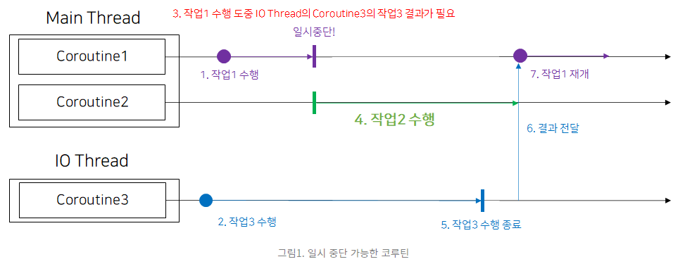

    위의 그림을 코딩하면 다음과 같다.
    ````````
    fun testCoroutine() {
        val job3 = CoroutineScope(Dispatchers.IO).async {
            Log.i("aaaa", "job3 수행시작")
            //(1..10000000).sortedByDescending { it }
            delay(10000)
            (1..10000).sortedByDescending { it }
        }
    
        val job1 = CoroutineScope(Dispatchers.Main).launch {
            Log.i("aaaa", "job1 수행시작")
    
            val job3Result = job3.await()
    
            Log.i("aaaa", "job1 await 수행시작")
            job3Result.forEach {
                Log.i("aaaa", "${it}")
            }
        }
    
        Log.i("aaaa", "job2 수행======")
        val job2 = CoroutineScope(Dispatchers.Main).launch {
            Log.i("aaaa", "job2 수행")
        }
    }
    ````````
    
    일시 중단하면 해당 디스패처에 다른 코루틴 작업이 있다면 다른 작업을 실행한다.
    job1을 실행중 await을 만나면 job2가 실행될것으로 생각 할 것이다.
    그런데 job1에서 결과를 기다리는 job3의 시간에 따라서 job2가 바로 실행될지, job1이 실행된 후 job2가 실행될지 결정되는것 같다.
    즉 job3에서 delay(10000)을 제거 하면 job1이 완료 후 job2가 실행되고, delay를 충분히 주어 job3가 오래 걸리는 작업이라면 job1 처리 도중 job2가 실행된다.

    일시 중단하는 작업을 함수로 옮길 수 있다. 이때 suspend fun을 사용한다.
    
    ````````
    fun testCoroutine(){
            val job1 = CoroutineScope(Dispatchers.Main).launch {
                Log.i("aaaa", "job1 수행시작")
    
                val job3Result = suspendCoroutine()
    
                Log.i("aaaa", "job1 await 수행시작")
                job3Result.forEach {
                    Log.i("aaaa", "${it}")
                }
            }
    
            Log.i("aaaa", "job2 수행======")
            val job2 = CoroutineScope(Dispatchers.Main).launch{
                Log.i("aaaa", "job2 수행")
            }
        }
    
        suspend fun suspendCoroutine() : List<Int>{
            val job3 = CoroutineScope(Dispatchers.IO).async {
                Log.i("aaaa", "job3 수행시작")
                //(1..10000000).sortedByDescending { it }
                delay(10000)
                (1..1000).sortedByDescending { it }
            }
    
            return job3.await()
        }
    ````````
# job의 즉시 실행이 아닌 필요시 실행하게 하는 방법
  - 코루틴 빌더인 launch 메서드를 별도의 옵션 없이 사용하면 생성된 비동기 작업(Job)은 생성 후에 바로 실행된다.
    하지만 실제 적용시 미리 job을 만들어 놓고 필요시 실행하게 할 필요도 있다.
    이경우 Job을 생성하는 launch 메서드에 CoroutineStart.LAZY 인자를 넘겨야 한다.
    Lazy하게 생성된 Job은 두가지 방법으로 실행 가능하다. 바로 start() 메서드와 join() 메서드이다.
    
    - start : 일시중단 없이 실행되는 메서드. 즉 코루틴을 실행시켜 놓코 끝날때까지 대기 하지 않는다.
              ````````
              var mJob1 : Job? = null
              fun createJob(){
                  mJob1 = CoroutineScope(Dispatchers.Main).launch(start = CoroutineStart.LAZY){
                      Log.i("aaaa", "job1 LAZY 실행")
                  }
              }
                
              fun coroutineLazy(){
                  mJob1?.start()
              }
                
              val onClickListener = View.OnClickListener {
                  when(it.id)
                  {
                      R.id.btn_start->{
                          coroutineLazy()
                      }
                  }
              }
              ````````
    - join :  해당 job이 종료될때까지 기다린다.
              종료될때까지 기다려야 하므로 join()은 일시중단이 가능한 코루틴 내부나 suspend fun 내부에서 사용되어야 한다.
    
              ````````
              val onClickListener = View.OnClickListener {
                  when(it.id)
                  {
                      R.id.btn_start->{
                          CoroutineScope(Dispatchers.Main).launch{
                              coroutineLazy()
                          }
                      }
                  }
              }
              ````````
              
# Job의 상태
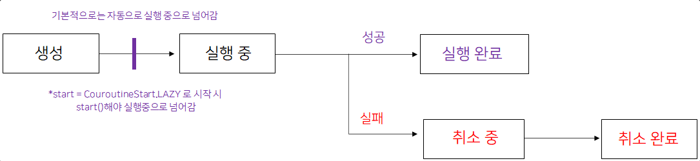

  * Job의 상태는 생성, 실행 중, 실행 완료, 취소 중, 취소 완료 총 5가지이다.
  
  - 생성(New) : Job이 생성된다.
  - 실행 중(Active) : Job이 실행 중이다.
  - 실행 완료(Completed) : Job의 실행이 완료되었다.
  - 취소 중(Cancelling) : Job이 취소되는 중이다. Job이 취소되면 리소스 반환 등의 작업을 해야 하기 때문에 취소 중 상태가 있다. 
  - 취소 완료(Cancelled) : Job의 취소가 완료되었다.
  
  * job은 항상 실행에 성공하여 실행 완료 상태가 되지는 않는다. 다양한 변수로 인해 중간에 취소되어야 할 수 있다.
    서버에 정보 요청을 하였는데 응답이 오지 않는다면?
    이러한 상황에서는 일정 시간 이후에 Job을 취소하는 작업이 필요하다. 또한 Job을 취소했을 때 생기는 Exception에 대한 Handling이 필요하다.
    
    job을 취소하는 방법은 cancel에 의해서 취소 가능하다.
    
    ````````
    fun testJobCancel(){
        val job = CoroutineScope(Dispatchers.Main).launch{
            Log.i("aaaa", "job2 수행")
            delay(1000)
        }
    
        job.invokeOnCompletion { _throwable->
            Log.i("aaaa", "$_throwable")
        }
    
        job.cancel("cancel job", InterruptedException("Cancelled!!!"))
    }
    ````````
    
    cancel에 의해서 취소 되면 invokeOnCompletion이 호출된다.
    invokeOnCompletion에 호출된 결과값은 다음과 같다.
    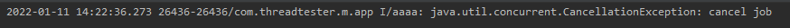
    
    그런데 문제는 정상적으로 완료 되었을때도 invokeOnCompletion이 호출된다.
    따라서 _throwable 결과값에 따른 처리가 필요하다.
    
    ````````
    job.invokeOnCompletion { _throwable->
            when(_throwable){
                is CancellationException -> Log.i("aaaa", "$_throwable")
                null -> Log.i("aaaa", "success")
            }
        }
    ````````
    
  * Job의 상태를 체크 할수 있는 함수는 다음과 같다.
    - isActive: Job이 실행중인지 여부를 표시
    - isCancelled: Job cancel이 요청되었는지 여부를 표시
    - isCompleted: Job의 실행이 완료되었거나 cancel이 완료었는지를 표시 
    
  * 그렇다면 Job을 생성하는 launch 메서드에 CoroutineStart.LAZY를 통하여 추후에 실행하게 한다면?
  
    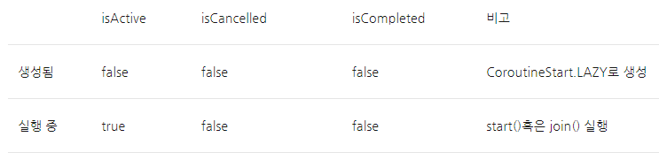
  
    Job이 CoroutineStart.LAZY로 생성되면 Job은 생성됨(New)상태에 머문다. 이 때는 실행중도 아니고, 취소도 요청되지 않았고, 완료되지도 않았으므로 isActive, isCancelled, isCompleted가 모두 false이다. 
    이제 start()혹은 join()을 통해 Job이 실행 중 상태로 바뀌면 isActive가 false에서 true로 바뀐다.
   
  * Job의 cancel이 호출되었을 때 해당 상태
  
    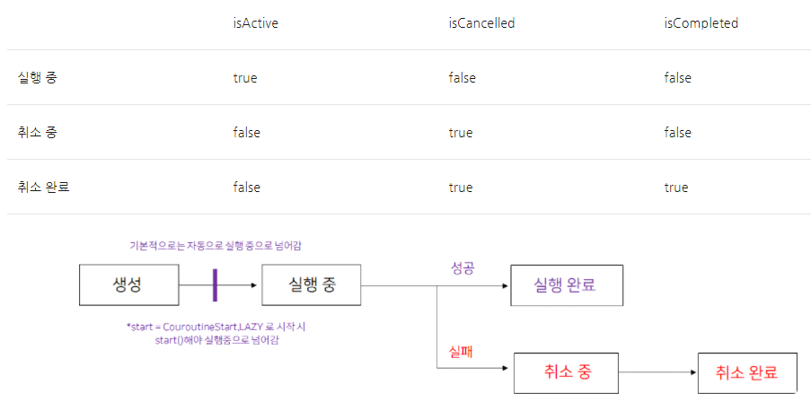
    
    먼저 Job은 취소 중 상태로 바뀐다. isCancelled는 취소가 요청되었는지에 대한 변수로 cancel이 호출되면 항상 true가 된다.
    하지만, 취소 중인 상태에서는 취소가 완료(Complete)되지 않았으므로 isCompleted가 false이다.
    취소가 완료되면 isCompleted는 true로 바뀐다. invokeOnCompletion은 isCompleted의 상태를 관찰하는 메서드로 isCompleted가 false에서 true로 바뀔 때 호출된다. 따라서 취소가 완료되었을 때도 호출된다.
    
  * Job이 완료되었을 때 상태 변화
  
    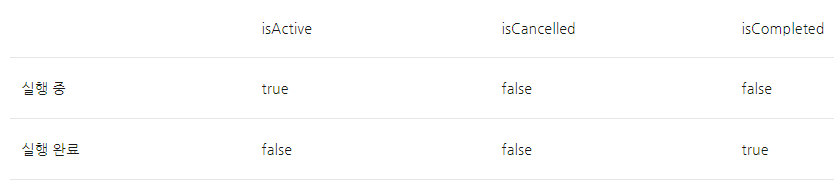
    
    isActive가 true에서 false로 바뀌며 isCompleted가 false에서 true로 바뀐다.
    isCompleted가 false에서 true로 바뀌었으므로 위 cancel과 마찬가지로 invokeOnCompletion 을 통해 설정된 람다식이 호출된다.
    
  * 결론
    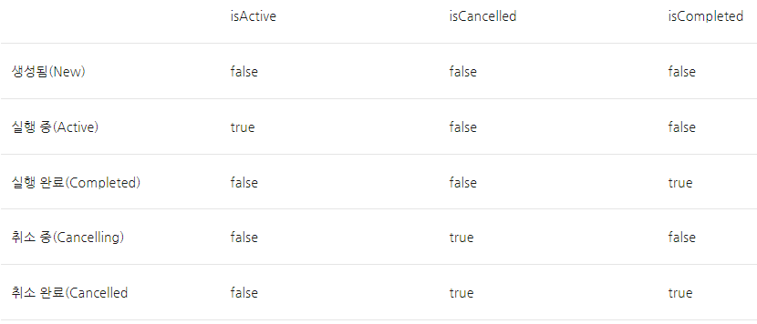
   
# Job의 예외처리1
  - 잡의 오류를 처리 하는 방법은 invokeOnCompletion을 이용한 방법과 CoroutineExceptionHandler 을 이용하는 방법이 있다.
    invokeOnCompletion을 이용하는 방법은 앞서 살펴보았다.
    
    CoroutineExceptionHandler을 이용여 오류처리하는 방법
    ````````
    fun testExceptionHaneler(){
        val exceptionHandler = CoroutineExceptionHandler { _, exception ->
            Log.i("aaaa", "$exception")
        }
    
        val job1 = CoroutineScope(Dispatchers.IO).launch(exceptionHandler) { // root coroutine, running in GlobalScope
            throw IllegalArgumentException()
        }
    
        val job2 = CoroutineScope(Dispatchers.IO).launch(exceptionHandler) { // root coroutine, running in GlobalScope
            throw InterruptedException()
        }
    }
    ````````
    exceptionHandler는 CoroutineExceptionHandler을 구현하며 exception이 왔을 때 받은 exception을 출력해준다. 
    
# Deferred
  - Deferred는 직역하면 연기라는 뜻을 가진다. "결과값 수신을 연기한다"라는 뜻인데, 이는 미래의 어느 시점에 결과값이 올 것을 뜻한다.
    Deferred의 의미와 같이 "Deferred는 결과값을 수신하는 비동기 작업" 이라고 정의될 수 있다.
    Deferred는 결과가 있는 비동기 작업을 수행하기 위해 결과 값이 없는 Job을 확장하는 인터페이스이다. 즉, Deferred는 Job이며, 이로 인해 Deferred는 Job의 모든 특성을 갖는다.
    ````````
    val deferred: Deferred<Int> = CoroutineScope(Dispatchers.IO).async {
            30
        }
    
    val deferredResult = deferred.await() // deferred에서 결과가 올 때까지 일시중단
    ````````
    
    Deferred가 Job과 다른 점은, 예외가 자동으로 전파되는 Job과 달리 Deferred는 예외를 자동으로 전파하지 않는다는 점이다.
    이는 Deferred가 결과값 수신을 대기해야 하기 때문이다.
    Deferred는 결과값 수신을 대기하고 예외를 전파하기 위해 특수한 메서드를 사용하는데 그것이 바로 위에서 다룬 Deferred 인터페이스 상의 결과값 수신 메서드인 await()이다.
    ````````
    fun testExceptionHaneler(){
        val exceptionHandler = CoroutineExceptionHandler { _, exception ->
            Log.i("aaaa", "$exception")
        }
    
        val job1 = CoroutineScope(Dispatchers.IO).async(exceptionHandler) { // root coroutine, running in GlobalScope
            throw IllegalArgumentException()
            0
        }
    
        val job2 = CoroutineScope(Dispatchers.IO).async(exceptionHandler) { // root coroutine, running in GlobalScope
            throw InterruptedException()
            0
        }
    }
    ````````
    exceptionHandler가 호출되지 않는다.!!!
    다음과 같이 한다면??
    ````````
    fun testExceptionHaneler(){
        CoroutineScope(Dispatchers.Main).launch{
            val exceptionHandler = CoroutineExceptionHandler { _, exception ->
                Log.i("aaaa", "$exception")
            }
    
            val job1 = CoroutineScope(Dispatchers.IO).async(exceptionHandler) { // root coroutine, running in GlobalScope
                throw IllegalArgumentException()
                0
            }
    
            val job2 = CoroutineScope(Dispatchers.IO).async(exceptionHandler) { // root coroutine, running in GlobalScope
                throw InterruptedException()
                0
            }
    
            job1.await()
            job2.await()
        }
    }
    ````````
    
    ExceptionHandler에서 에러를 처리하는 것이 아닌 Main Thread에 애러가 전파되어 Main Thread가 에러로 강제종료되어 버린다.
    
    그러면 해결 방법은??
    ````````
    fun testExceptionHaneler(){
        CoroutineScope(Dispatchers.IO).launch{
            val exceptionHandler = CoroutineExceptionHandler { _, exception ->
                Log.i("aaaa", "$exception")
            }
    
            val job1 = CoroutineScope(Dispatchers.IO).async { // root coroutine, running in GlobalScope
                throw IllegalArgumentException()
                0
            }
    
            val job2 = CoroutineScope(Dispatchers.IO).async { // root coroutine, running in GlobalScope
                throw InterruptedException()
                0
            }
    
            CoroutineScope(Dispatchers.Main).launch(exceptionHandler){
                job1.await()
                job2.await()
                Log.i("aaaa", "====")
            }
        }
    }
    ````````
    
    exceptionHandler 설정을 async에서 하는것이 아닌 별도의 블록을 만들어 Exception을 처리 하게 하면 된다.
    예외가 부모 코루틴에 전파되면 부모 코루틴에서 예외처리를 한다.

# 별도의 thread, thread pool을 만드는 방법
  - 현재까지는 Dispatchers.IO, Dispatchers.Default, Dispatchers.MAIN에 있는 thread pool을 이용하여 작업을 하였다.
    그러나 별도의 thread 혹은 thread pool을 만들어 처리도 가능하다.
    
    - newSingleThreadContext(name: String) : Single Thread를 만드는 메서드
    - newFixedThreadPoolContext(nThreads: Int, name: String) : Thread Pool을 만드는 메서드
    
    ````````
    fun testCustomThread(){
        val singleThreadDispatcher = newSingleThreadContext("Single Thread ThreadPool")
        val dispatcherWith2Threads = newFixedThreadPoolContext(2,"ThreadPool with 2 threads")
    
        CoroutineScope(singleThreadDispatcher).launch {
            val aaaa = CoroutineScope(dispatcherWith2Threads).async {
                (1..100).sortedByDescending { it }
            }
    
            val bbbb = CoroutineScope(dispatcherWith2Threads).async {
                (1..100).sortedByDescending { it }
            }
    
            val cccc = CoroutineScope(dispatcherWith2Threads).async {
                (1..100).sortedByDescending { it }
            }
    
            val result1 = aaaa.await()
            val result2 = bbbb.await()
            val result3 = cccc.await()
    
            Log.i("aaaa", "$result1")
            Log.i("aaaa", "$result2")
            Log.i("aaaa", "$result3")
        }
    }
    ````````
    
# withContext
  - 비동기 작업 순차화
  - 사용할일이 얼마 없을꺼 같아서 일단 패스..
  
# CoroutineContext
  - Dispatcher: 코루틴이 실행될 스레드 풀을 잡고 있는 관리자
  - CoroutineExceptionHandler: 코루틴에서 Exception이 생겼을 때의 처리기
  - 그런데 이 두 가지 요소는 CoroutineContext가 들어가야 할 자리에 그대로 들어갈 수 있다.
  
  ````````
  val job = CoroutineScope(Dispatchers.IO).async{}
  val job2 = CoroutineScope(exceptionHandler).launch{}
  ````````

  - 이것이 가능한 이유는?
    두개 모두 CoroutineContext를 확장하는 인터페이스의 구현체이기 때문이다.
    
    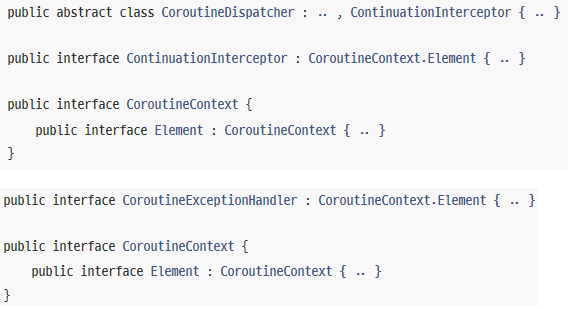
    
    CoroutineContext는 Coroutine이 실행되는 환경이다.
    Dispatcher와 CoroutineExceptionHandler 또한 Coroutine이 실행되는 환경의 일부이다.
    
  - 따라서 내부적으로 같은 성질의 데이터형을 사칙연산하게 만들었다.
  
    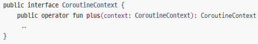 
    
    결국 다음과 같은 코드가 가능하다.
    ````````
    val exceptionHandler = CoroutineExceptionHandler{_, _exception->
            when(_exception)
            {
                is IllegalArgumentException -> Log.i("aaaa", "More Argument Needed To Process Job")
                is InterruptedException -> Log.i("aaaa", "Job Interrupted")
            }
        }
    
    val aaa =  Dispatchers.IO + exceptionHandler
    
    CoroutineScope(aaa).launch{}
    ````````
    
  - 특정 CoroutineContext에 접근하는 방법
    키값을 통해 접근 가능하다.
    
    ````````
    val getExceptionHandler = aaa[exceptionHandler.key]
    val getExceptionHandler2 = aaa[Dispatchers.IO.key]
    ````````
    
  - 특정 CoroutineContext를 삭제 하는 방법
  
    ````````
    val resultKey = aaa.minusKey(exceptionHandler.key)
    
    assert(resultKey == Dispatchers.IO))        // 남아있는 CoroutineContext는 Dispatchers.IO이다.
    ````````
    
# 예외처리2
  - 코루틴 내부에서 수행되는 자식 코루틴에 애러가 생겼을 때 별도의 Exception Handler을 설정해주지 않으면 자식 코루틴은 부모 코루틴까지 취소시키게 된다. 부모 코루틴이 취소되면 당연히 부모의 자식으로 있는 코루틴이 모두 취소된다.
    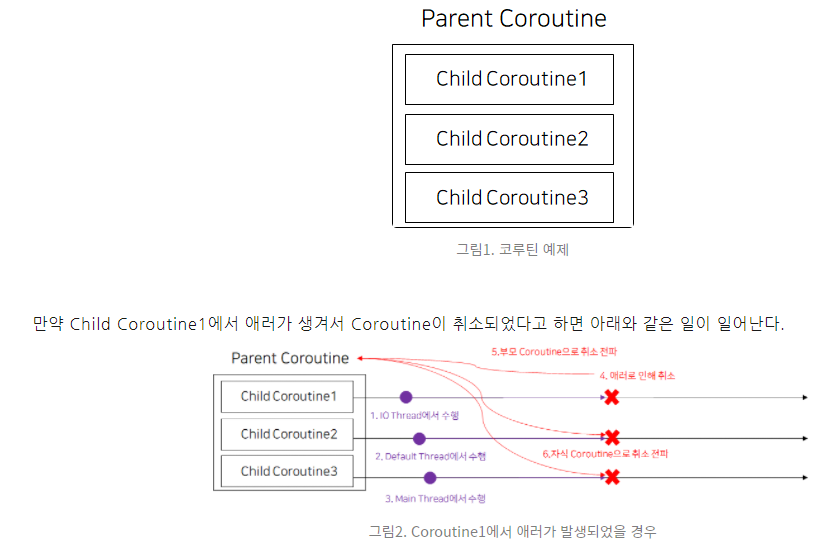
    
    1. Child Coroutine1의 취소가 부모 Coroutine에게 전파된다. 이로 인해 부모 Coroutine이 취소된다.
    2. 부모 Coroutine의 취소가 Child Coroutine2와 Child Coroutine3으로 전파된다.
    
    위의 현상은 각 Child Coroutine들이 다른 Dispatcher에서 수행되어도 상관없다. 부모 코루틴이 종료되면 자식 Coroutine은 모두 취소된다.
    
  - 단방향 Exception 전파를 위한 SupervisorJob
    에러의 전파 방향을 자식으로 한정짓다. 즉 SupervisorJob을 자식 Coroutine(Child Coroutine)에 사용하면 에러가 부모 Coroutine(Parent Coroutine)로 전파되지 않는다.
    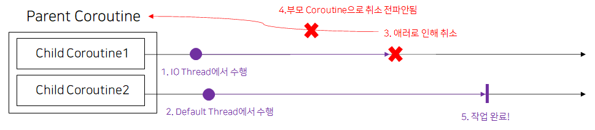
    
    ````````
    fun testExceptionHaneler(){
        CoroutineScope(Dispatchers.IO).launch{
            val supervisor = SupervisorJob()
    
            val exceptionHandler = CoroutineExceptionHandler { _, exception ->
                Log.i("aaaa", "$exception")
            }
    
            val job1 = CoroutineScope(Dispatchers.IO+supervisor).async { // root coroutine, running in GlobalScope
                throw IllegalArgumentException()
                0
            }
    
            val job2 = CoroutineScope(Dispatchers.IO+supervisor).async { // root coroutine, running in GlobalScope
                //throw InterruptedException()
                Log.i("aaaa", "둘째 잡은 살아있다.")
                0
            }
    
            CoroutineScope(exceptionHandler).launch{
                val aa = job1.join()
                val bb = job2.join()
                Log.i("aaaa", "여기까지 실행된다.")
            }
        }
    }
    ````````
  - supervisorScope
    매번 CoroutineContext에 SupervisorJob을 설정할 필요 없이 특정 블록 내부의 모든 코루틴에 Supervisor Job을 설정하고 싶을 수 있다. 이 때 사용하는 것이 바로 supervisorScope이다.
    
    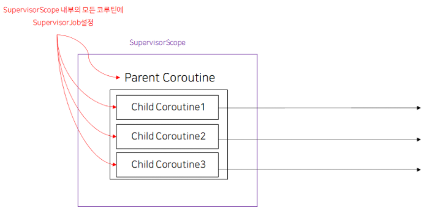
    ````````
    fun testCoroutine4(){
        CoroutineScope(Dispatchers.IO).launch{
            supervisorScope {
                val firstChildJob = launch(Dispatchers.Default) {
                    throw AssertionError("첫째 AssertionError로 인해 취소됩니다.")
                }
    
                val secondChildJob = launch(Dispatchers.Default) {
                    delay(1000)
                    Log.d("aaaa", "secondJob")
                    throw AssertionError("둘째 AssertionError로 인해 취소됩니다.")
    
                    Log.d("aaaa", "secondJob")
                }
    
                firstChildJob.join()
                secondChildJob.join()
            }
        }
    }
    ````````
    
    그런데 테스트 해보면 알겠지만  secondChildJob이 실행되기 전에 firstChildJob이 throw AssertionError을 떨구는경우가 생긴다. 결국 secondChildJob이 실행 될때도 있고, 안될때도 있다.
    
================================ To Be Continue ================================================================    