# Flow 개념정리
========================================================

# 리액티브 프로그래밍이란?
리액티브 프로그래밍이란 데이터가 변경 될 때 이벤트를 발생시켜서 데이터를 계속해서 전달하도록 하는 프로그래밍 방식이다.

기존 명령형 프로그래밍에서는 데이터의 소비자는 데이터를 요청한 후 받은 결과값을 일회성으로 수신한다.
하지만, 이러한 방식은 데이터가 필요할 때마다 결과값을 매번 요청해야 한다는 점에서 매우 비효율적이다.
리액티브 프로그래밍에서는 데이터를 발행하는 발행자가 있고 데이터의 소비자는 데이터의 발행자에 구독 요청을 한다.
그러면 데이터의 발행자는 새로운 데이터가 들어오면 데이터의 소비자에게 지속적으로 발행한다.

# Coroutine Flow를 이용한 리액티브 프로그래밍
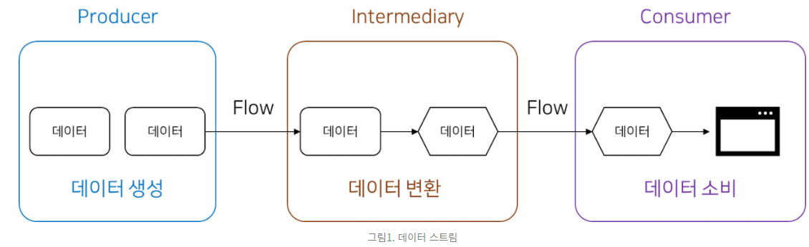

    - Producer : 데이터를 생산한다.
    - Intermediary : 데이터를 ui에 맞게 가공한다.
    - Consumer : 데이터를 소비한다. ui에 데이터를 그려준다.
   
* [Producer]
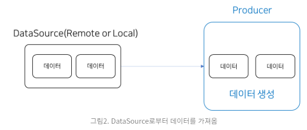

    - Producer은 로컬DB또는 Restfull Api를 통해서 필요한 데이터를 얻어와서 발행한다.
    - 발행은 flow{ } 블록 내부에서의 emit()을 통해 데이터를 발행한다.

    * flatMapConcat을 사용하여 flow를 다른 flow로 변환
        - flow를 연결해 새로운 flow를 만든다.
        - flow간에 연결이 필요할 경우 flatMapConcat을 이용해 연결을 하면 된다.
  
        ``````
        startStopWatch().flatMapConcat { _value->
                                flow{
                                    emit(_value + 1000)
                                    emit(_value + 2000)
                                    emit(_value + 3000)
                                }
                            }.collect {_time->
                                obsTime.value = _time
                                Log.i("aaaa", "flatMapConcat : ${_time.toString()}")
                            }
        ``````
  
        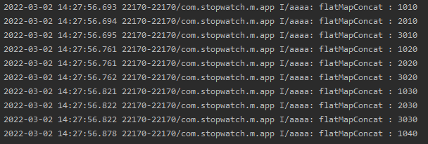
  
        - 10ms마다 발행된 값을 각각 1000, 2000, 3000씩 더해서 다시 발행했다.
  
    * flatMapLastest를 사용하여 최신 데이터만 flow 변환.
    
        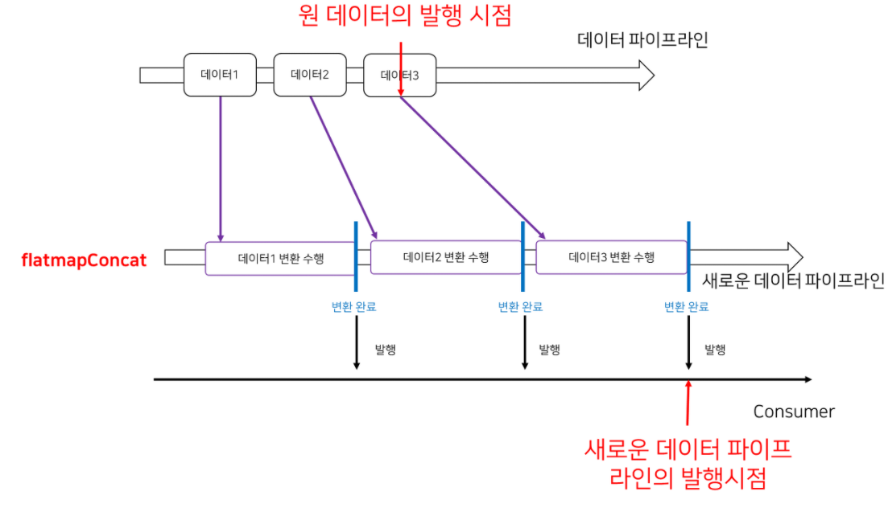
    
        - flatMapConcat은 원 flow에서 발행된 데이터가 순차적으로 처리되어 새로운 flow를 만들어낸다.
          이 말은 데이터 처리하는데 오래 걸리는 연산이 변환 값으로 들어올 경우 데이터가 처리되는데 오래 걸릴 것이다. collect와 비슷한 단점이 있다.
          만약 1초에 수십개의 데이터가 flow를 통해 들어올 경우 변환된 데이터의 발행 시점과 변환되기전 데이터의 발행 시점 사이에 많은 차이가 생길 수 있다.
          이것을 보완한것이 flatMapLastest 이다.
        - flatMapLatest를 사용하면 flow에서 발행된 데이터를 변환하는 도중 새로운 데이터가 발행될 경우, 변환 로직을 취소하고 새로운 데이터를 사용해 변환을 수행한다.
        - 동작은 collectLastest와 유사하다.
  
    * flatMapMerge을 사용해 flow 변환 동시 처리.
        - flatMapConcat과 flatMapLatest는 flow에서 발행된 데이터를 변환할 때 발행된 순서대로 순차적으로 변환한다. 반대로 flatMapMerge는 변환을 병렬로 수행한다.
        - 따라서 순서가 중요하지 않은 변환에서는 flatMapConcat이나 flatMapLastest 대신 flatMapMerge를 사용하면 연산 속도를 수십배 빠르게 만들 수 있다.
    
* [Intermediary]

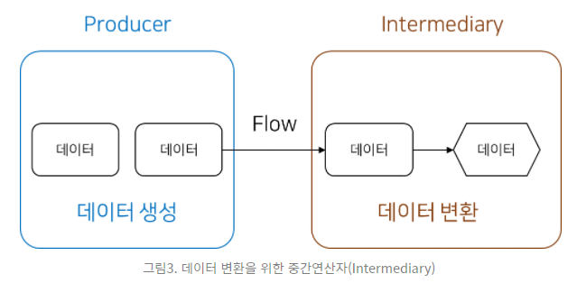

    - 데이터를 UI에 맞게 변환한다.
    - 대표적인 중간 변환연산자는 map(데이터 변형), filter(데이터 필터링), onEach(모든 데이터마다 연산 수행)등이 있다.

* [Consumer]

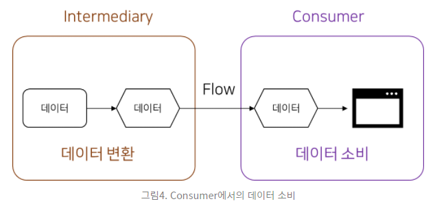

    - Intermediary에서 변환된 데이터를 소비한다. Flow에서는 collect를 이용해 전달된 데이터를 소비할 수 있다.
    - 데이터의 소비는 collect, collectLatest호출에 희해서 소비된다.
  
    * collect
    
    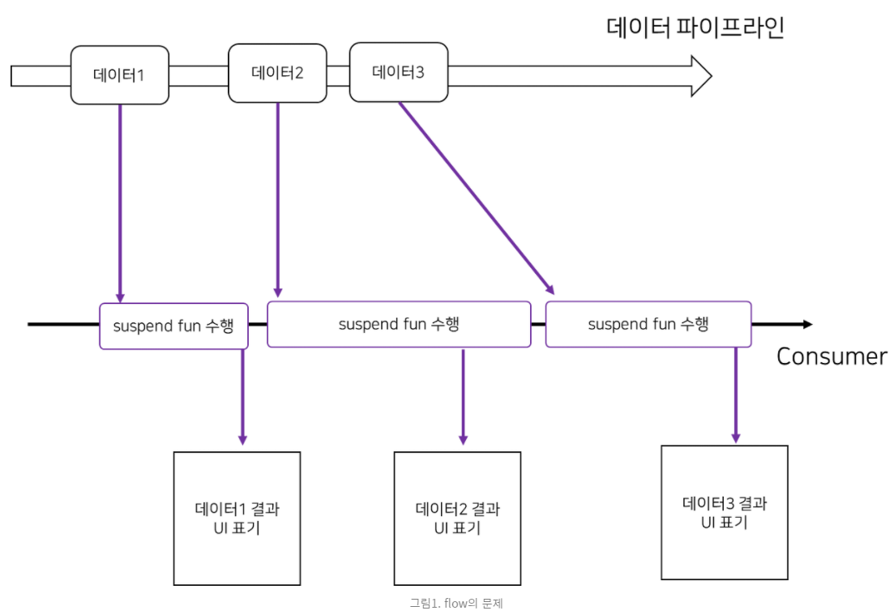
    
        - 현재 들어온 데이터를 즉시 소비한다.
          하지만 소비하는데 시간이 걸린다면 새로운 데이터가 발행되었을때 처리도 그만큼 늦어진다.
          하나의 코루틴 안에서 실행되기 때문에 그렇다.
        
        ``````
            val TIMER_INTERVAL = 10L
        
            private fun startStopWatch() : Flow<Long>{
                return flow{
                    var count = 0L
                    while(true){
                        delay(TIMER_INTERVAL)
                        count += TIMER_INTERVAL
                        emit(count)
                    }
                }
            }
        
            viewModelScope.launch {
                            startStopWatch().collect {_time->
                                obsTime.value = _time
                                Log.i("aaaa", _time.toString())
                                delay(1000)
                            }
                        }
        ``````
    
        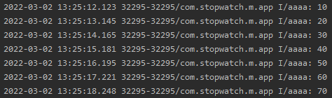
        
        - 발행은 10ms로 하는데 소비는 1000ms로 한다. 따라서 1초에 한번씩 실행하게 된다.

* collectLatest


    - collect의 문제점을 해결하면서 소비한다.
    - 최신 데이터가 들어왔을 때 이전 데이터를 이용해 수행하던 suspend fun을 취소하고 새로 들어온 데이터로 suspend fun을 수행하도록 만드는 것이다.
  
      ``````
      viewModelScope.launch {
                              startStopWatch().collectLatest {_time->
                                  obsTime.value = _time
                                  Log.i("aaaa", _time.toString())
                                  delay(1000)
                              }
                          }
      ``````
  
    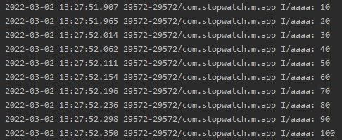
    
    - 중간에 suspend fun을 취소하기 때문에 정상적으로 소비를 한다.
  
    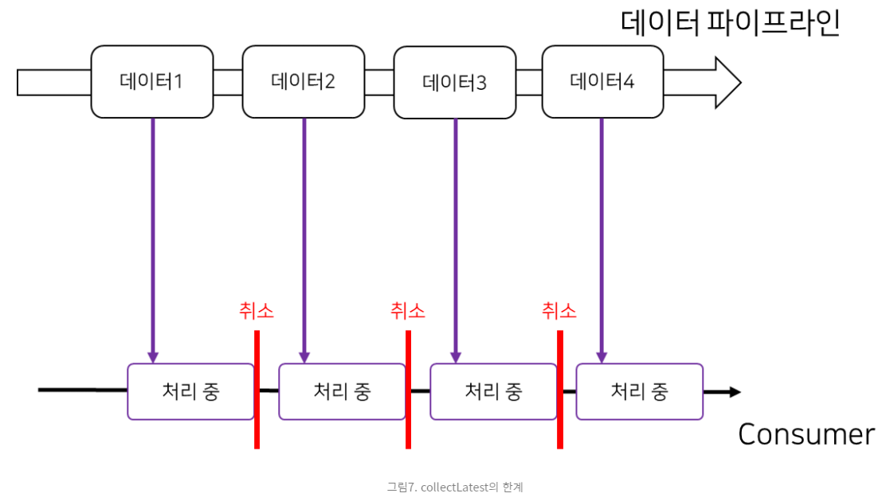
    
    - collectLatest의 문제점은 데이터 발행 시간 사이의 간격보다 데이터를 처리하는 suspend fun이 수행하는 시간이 오래 걸릴 경우,
      새로 들어온 데이터가 있다면 현재 작업이 계속해서 취소되게 된다.
      즉 이런 상황에서 collectLatest를 쓸 경우 중간 데이터를 하나도 얻지 못하고 마지막 데이터만을 얻을 수 있다.
        
    ``````
    viewModelScope.launch {
                        startStopWatch().collectLatest {_time->
                            delay(1000)
                            obsTime.value = _time
                            Log.i("aaaa", _time.toString())
                        }
                    }
    ``````       
    
    
    
    - 소비를 하였으나 1000ms 지연(delay)을 하고 데이터를 처리 하였다.
      하지만 delay시점에 suspend fun취소가 일어나서 아무런 처리도 못하게 된다.

    * conflate를 사용한 최신 데이터 collect
        - 앞서 collectLatest를 사용할 경우 데이터 발행 시간 사이의 간격보다 데이터를 처리하는 suspend fun이 수행하는 시간이 오래 걸릴 경우,
          새로 들어온 데이터는 계속해서 소비되지 못한다. 즉 이런 상황에서 collectLatest를 쓸 경우 중간 데이터를 하나도 얻지 못하고 마지막 데이터만을 얻을 수 있다고 했다. 
          
        - 이것을 보완하는 방법은 conflate를 사용하는 것이다.
          한 번 시작된 데이터 소비는 끝날 때까지 하고 데이터 소비가 끝난 시점에서의 가장 최신 데이터를 다시 소비하는 것이다.
            
        ``````
        viewModelScope.launch {
                            startStopWatch()
                                    .onEach {_time->
                                        Log.i("aaaa", "onEach : ${_time.toString()}")
                                    }
                                    .conflate().collect {_time->
                                        delay(1000)
                                        obsTime.value = _time
                                        Log.i("aaaa", "conflate().collect : ${_time.toString()}")
                                    }
                        }
        ``````
    
    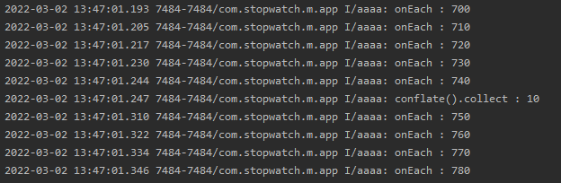
    
    - 발행은 계속 되지만 처음 소비는 740ms에서 소비되었다.
    
    * buffer을 사용한 데이터 소비의 최적화.
    
    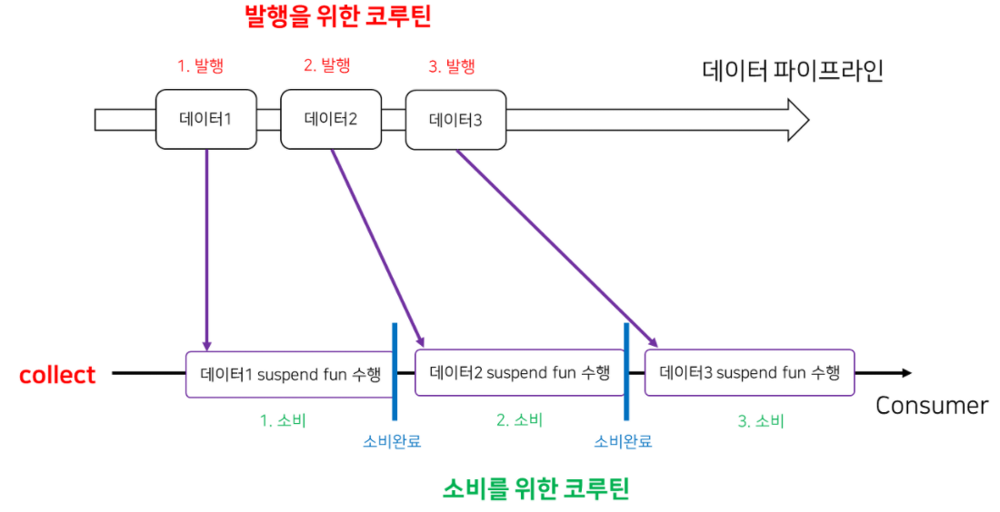
    
        - collect를 사용하면 하나의 Coroutine에서 발행과 소비가 같이 일어나기 때문에 데이터가 발행된 후 소비가 끝나고 나서 다시 다음 데이터가 발행된다. 즉 발행과 소비가 순차적으로 일어난다.
        - 이 방법은 발행하는 쪽이나 소비하는 쪽의 delay를 미리 처리하지 않는다면 발행쪽과 소비쪽 모두 delay가 생기기 때문에 비효율 적이다.
        - 이부분을 해결하는 방법은 buffer을 사용하여 발행부분의 Coroutine과 소비부분의 Coroutine을 분리하는 것이다.
  
    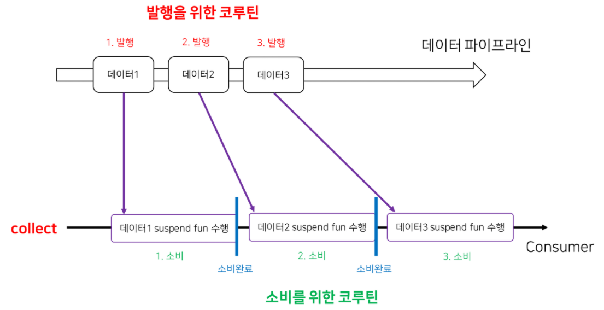

        - 발행쪽에서 발행(emit)은 별도의 Coroutine에서 수행되므로 계속해서 일어나고, 소비가 끝나는대로 바로바로 다음 데이터가 소비하게 하는것이다.
          이를 통해 발행에 생기는 지연을 방지할 수 있다.
  
        ``````
        viewModelScope.launch {
                            startStopWatch()
                                    .onEach {_time->
                                        Log.i("aaaa", "onEach : ${_time.toString()}")
                                    }
                                    .buffer().collect {_time->
                                        delay(1000)
                                        obsTime.value = _time
                                        Log.i("aaaa", "conflate().collect : ${_time.toString()}")
                                    }
                        }
        ``````
    
        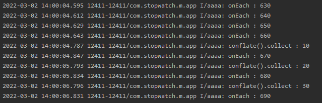
  
        - 발행은 발행대로 Corutine이 작동되고, 소비는 소비대로 Corutine작동한다.
          하지만 버퍼의 크기가 무한대인것은 아닌듯하다.
          660ms후에 첫 소비가 되었지만, 그때부터는 한개의 소비가 일어난 후에 다음 발행이 일어난다.


  