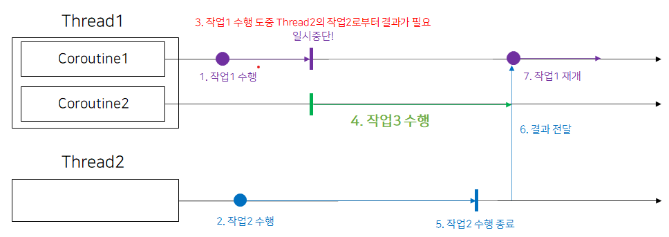

# Coroutine
**스레드 안에서 실행되는 일시 중단 가능한 작업의 단위이다. 하나의 스레드에 여러 코루틴이 존재 할 수 있다.** 한 스레드가 다른 스레드로부터 작업의 결과를 기다려야 할 때 Blocking되게 되면 해당 스레드는 그 스레드의 작업이 끝날때까지 기다려야 하기 때문에 자원이 낭비된다. 코루틴은 해당 스레드를 Blocking하는 대신 자신의 작업을 일시중단하고 다른 코루틴에게 스레드 사용 권한을 넘겨주어 스레드의 리소스를 최대한 활용할 수 있게 해준다.


## Dispatcher
코루틴을 만든 다음 해당 코루틴을 Dispatcher에 전송하면 Dispatcher은 자신이 관리하는 스레드풀 내의 스레드의 부하 상황에 맞춰 코루틴을 배분한다.
- Dispatchers.Main : Android 메인 스레드에서 코루틴을 실행하는 디스패처이다. UI와 상호작용하는 작업을 실행하기 위해서만 사용해야 한다.
- Dispatchers.IO -  디스크 또는 네트워크 I/O 작업을 실행하는데 최적화되어 있다.
- Dispatchers.Default - CPU를 많이 사용하는 작업을 실행하는데 최적하되어있다. 예를 들어 정렬 작업이나 JSON 파싱 작업 등을 할 수 있다.

## launch{}
launch는 결과를 반환하지 않고 job이 반환된다.
```kotlin
with(CoroutineScope(Dispatchers.Main) {
	val job: Job = launch { println(1) }
}
위와 같이 job이 생성 되면 생성과 동시에 실행된다. 코루틴 실행의 유연성이 떨어진다. 이를 해결하기 위해 job을 생성한 후 필요할 때 수행하도록 하는 옵션이 있다.

## async{}
결과를 반환하며 결과값은 Deferred로 감싸서 반환된다.
```kotlin
CoroutineScope.launch {
	val deferredInt: Deferred<Int> = async {
		println(1)
		1 // 마지막 줄 반환
	}
	val value = deferredInt.await() // await()은 일시 중단이 가능한 코루틴 내부에서만 사용.
	println(value)
}
```
await()는 일시 중단이 가능한 코루틴 내부에서만 사용이 가능하다.

## suspend
코루틴은 기본적으로 일시중단이 가능하다. 일시 중단을 코루틴 블록 내부에서 수행하지 않으면 일시 중단 함수로 바꾸라는 오류가 생기게 된다.
### 일시 중단 작업을 코루틴 내부로 옮기기
```kotlin
fun exCoroutine() {
    val job = CoroutineScope(Dispatchers.IO).async {
        (1..1000).sortedByDescending { it }
    }

    CoroutineScope(Dispatchers.Main).launch {
        job.await()
    }
}
```

### 메서드를 suspend fun으로 만들기
```kotlin
suspend fun exCoroutine() {
    val job = CoroutineScope(Dispatchers.IO).async {
        (1..1000).sortedByDescending { it }
    }

    job.await()
}
```

## job을 Lazy하게 실행하기.
```kotlin
val job = CoroutineScope(Dispatchers.Main).launch(start = CoroutineStart.LAZY) {
	println(1)
}
```
이렇게 생성되면 이 job은 수행되지 않고 대기 상태로 있는다.

Lazy하게 생성된 job을 실행하는 방법은 두가지가 있다.

- start() : 일시 중단 없이 실행되는 메서드이다. 실행되는 위치를 코루틴 내부나 suspend fun 내부로 바꾸는 것이 필요하지않다.
- join() : job이 종료될때까지 job이 실행되고 있는 코루틴을 일시중단 해준다.

IO Thread에서 작업이 수행되기 전에 Main Thread가 종료되면 프로세스가 종료되어 IO Thread에서 실행되고 있던 작업도 종료된다.  start()로 실행한 job은 Main Thread가 종료되면 같이 종료되어버리지만, join()으로 실행한 job은 IO Thread의 코루틴이 끝날 때까지 일시중단한 다음 다시 진행된다. 그래서 join()은 일시중단이 가능한 suspend fun 내부에서 사용되어야 한다.

## job 취소하기
서버에 데이터를 요청을 했을때 클라이언트에서는 정보를 요청하고 응답을 기다려야한다. 하지만 서버에서 응답을 주지 않는다면 우리는 계속 응답을 기다리고 있어야한다.

이러한 상황에서 일정 시간 이후에 job을 취소하는 작업이 필요하다.

- cancel()을 이용한 job 취소

```kotlin
suspend fun main() {
	val job = CoroutineScope(Dispatchers.IO).launch {
		delay(100)
	}
	job.cancel()
}
```

cancel()에 message: String, cause: Throwable 두가지 인자를 넘기는 것으로 취소의 원인을 넘길 수 있다. getCancellationException() 메서드로 취소의 원인을 알 수 있게 된다.

## withContext
다른 코루틴에서 보내진 작업의 결과를 수신하려면 Deferred로 결과값을 감싼 다음 await()을 통해 값이 수신될 때까지 기다려야 한다. withContext를 이용하면 이러한 작업을 간단하게 만들 수 있다.
```kotlin
suspend fun example() {
    val result = withContext(Dispatchers.IO) {
        //반환 값
    }
}
```
withContext 블록은 IO Thread의 작업이 끝나기 전까지 Main Thread에서 수행되는 코루틴을 일시중단하도록 만든다. 

## 참고 사이트
- https://developer.android.com/kotlin/coroutines?hl=ko
- https://kotlinworld.com/139?category=973476